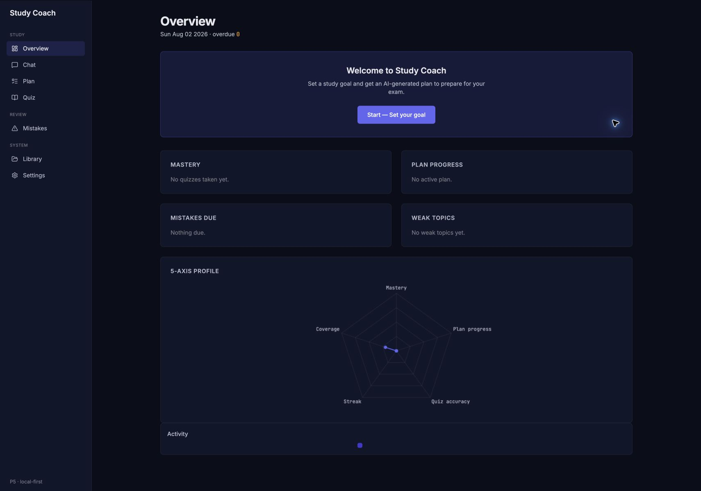
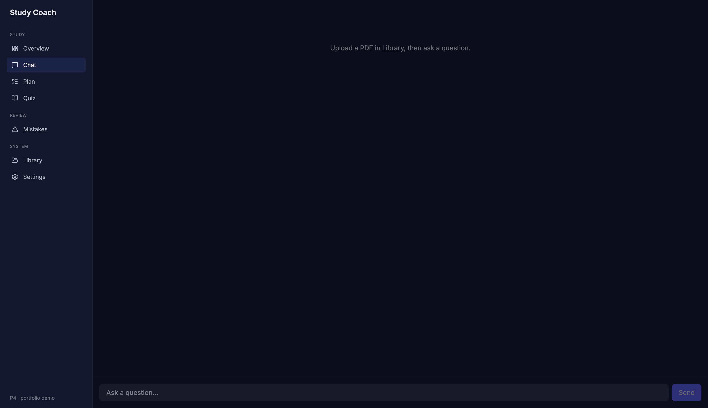
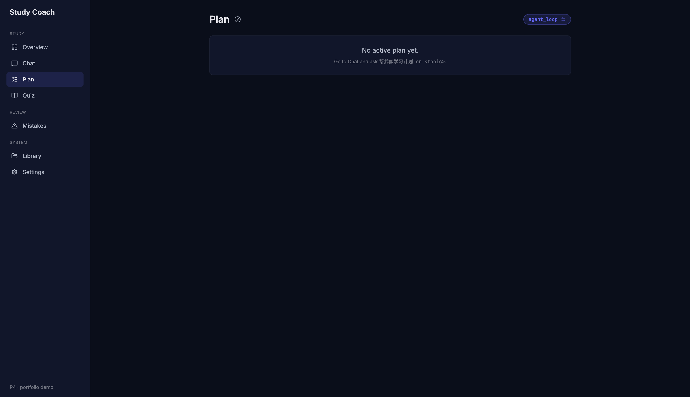
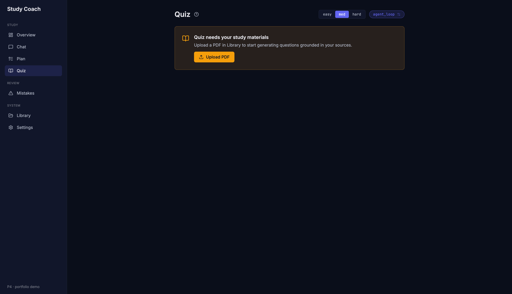
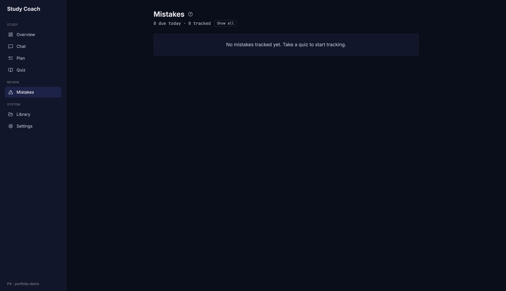
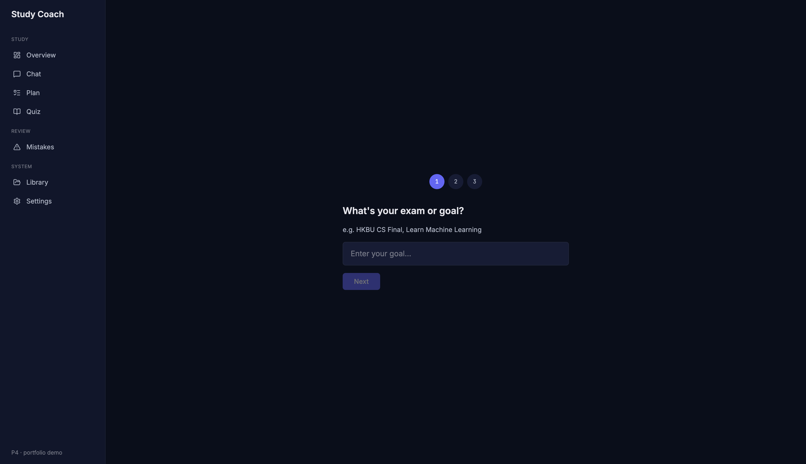
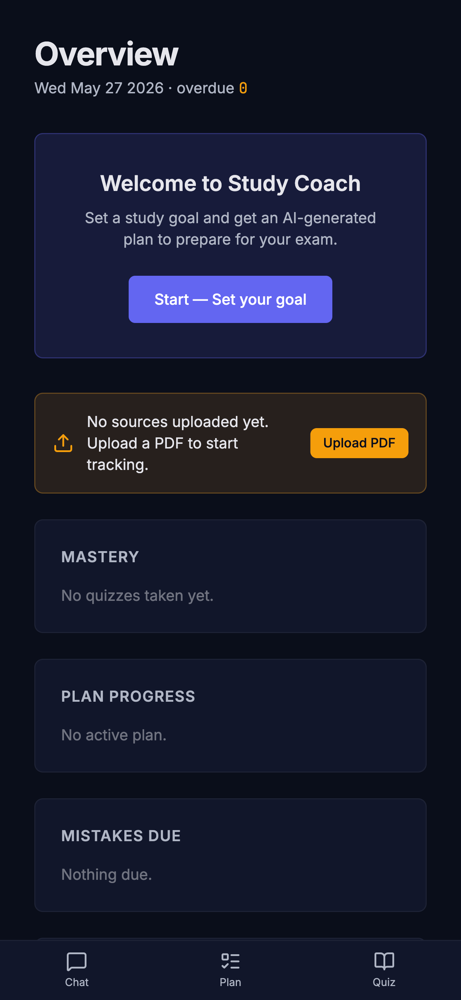

<div align="center">

# Study Coach

**AI-Powered Exam Coach Agent**

Upload your course PDFs → adaptive quiz loop → spaced-repetition mastery — all grounded in your materials.

[](https://www.python.org/)
[](https://fastapi.tiangolo.com/)
[](https://langchain.com/langgraph)
[](https://vuejs.org/)
[](https://www.typescriptlang.org/)
[](https://tailwindcss.com/)
[](https://www.docker.com/)
[]()
[](LICENSE)

</div>

---

## Portfolio Thesis

**HKBU_StudyCompanion** is a Prompt Engineering course project (COMP4146/7125, HKBU): local PDF RAG, HyDE, CoT study plan, MCQ quiz, LLM-as-Judge — but architecturally a **chain-of-prompts** with no persistent state, no agent loop, and no empirical evaluation.

[JadeAI](https://github.com/LingyiChen-AI/JadeAI) is the engineering reference: BYOK headers, repository pattern, DB persistence, tool-calling agent loop, and long-maintenance `ARCHITECTURE.md`.

**Study Coach** is the portfolio-grade refactor that bridges both worlds: the course project's four features (HyDE, CoT plan, MCQ, Judge) fully redesigned as a modern **LangGraph agent** with persistent memory, empirical agent-loop ablation, and a production-quality frontend.

**Study Coach is a local-first AI learning workspace. No registration is required.**

## Screenshots

| Overview Dashboard | Chat with Agent Trace |
|:---:|:---:|
|  |  |

| Plan Timeline + Gantt | Quiz Adaptive |
|:---:|:---:|
|  |  |

| Mistake Bank (SM-2 SRS) |
|:---:|
|  |

| Goal Setup Wizard | Mobile View |
|:---:|:---:|
|  |  |

## Features

### Core Agent Loop

- **LangGraph StateGraph** — Refactored from chain-of-prompts to a 7-node graph: MemoryHydrator → Router → {Tutor, QuizMaster, Planner} → Judge Guard → MemoryWriter
- **Keyword-based Router** — Classifies user intent (quiz > plan > tutor) with state-aware overrides for multi-turn flows
- **Judge Guard with PDCA** — 6-dimension tutor rubric, 5-dimension quiz/plan rubrics. Up to 2 retries with weak-dimension hints, degrade with disclaimer on exhaustion
- **Dual-mode dispatch** — Deterministic state-machine (predictable, fast) and agent-loop (LLM tool-calling) for both Planner and QuizMaster, switchable via HTTP headers
- **Chat quiz consistency** — Chat displays an answerable MCQ only after the backend has persisted the question and can grade the next `A/B/C/D` reply

### Retrieval-Augmented Generation

- **Hybrid Retrieval** — Dense embedding + BM25 + Reciprocal Rank Fusion (RRF)
- **Cross-Encoder Reranking** — `jina-reranker-v2-base-multilingual` via FastEmbed
- **Hit@5: 0.933, MRR: 0.822** on 15-query HKBU eval set (up from 0.733 / 0.633)
- **Grounded Quiz Generation** — Questions drawn from indexed PDF chunks, not model training distribution
- **User-corpus guard** — Chat refuses before retrieval when the current user has no uploaded documents, preventing stale Chroma chunks from leaking into answers

### Adaptive Learning

- **SM-2 Spaced Repetition** — Lite variant with implicit repetition count, ease factor floor 1.3
- **Quiz → Mistake → Mastery pipeline** — Wrong answers create SM-2 scheduled mistakes; redo cycles update mastery scores
- **Mark as Understood** — One-click permanent dismissal of mastered mistakes
- **Mastery Radar** — 5-axis profile: Mastery, Plan Progress, Quiz Accuracy, Streak, Coverage

### Local-First Data Lifecycle

- **No-registration startup** — When learning data exists, each tab must Continue with the instance's data or Start fresh before the rest of the app becomes interactive
- **Two reset scopes** — Learning reset removes study records and indexed source data while preserving local Settings; factory reset also clears local identity and owned browser settings
- **Cross-tab coordination** — Reset invalidates stale views across open tabs and blocks overlapping Chat/upload work for the full operation lifetime
- **Safe deployment default** — Destructive reset is disabled unless `STUDY_COACH_LOCAL_MODE=1`; Docker Compose enables it with the backend bound to loopback only

### BYOK Multi-Model

- **Per-request provider switching** — `x-provider` / `x-model` / `x-api-key` headers, never persisted server-side
- **Cross-model Judge** — `x-judge-model` header mitigates self-preference bias (empirical delta: 0.20–0.40)
- **Tool-call detection** — `GET /api/models/tool-check` probes model capability; agent-loop locked to deterministic when unsupported
- **Supported providers**: Ollama (local), OpenAI, Anthropic, Google Gemini

### Frontend

- **8 views**: Overview (dashboard + radar + heatmap), Chat (SSE streaming + current session restore + recoverable Agent Trace / Agent Run debug panel), Plan (milestone list + vertical Gantt timeline), Quiz (adaptive MCQ + grade result), Mistake Bank (SM-2 due list + redo), Library (PDF upload), Settings (BYOK + local preferences + language + Danger Zone), Onboarding (3-step goal setup wizard)
- **Dark Cinema design system** — Inter / JetBrains Mono / Noto Sans SC, indigo primary
- **i18n bilingual** — English / 中文 (zh-CN), switchable in Settings
- **Mobile responsive** — Bottom tab bar for Chat / Quiz / Plan on <768px viewports

### Deployment

- **Docker Compose** — Enables local reset, binds backend/frontend/Ollama host ports to loopback, routes backend embeddings to the Ollama service, and passes frontend HTML plus direct/proxied health runtime smoke checks
- **fly.io fallback** — Single-container cloud deploy with BYOK cloud-only mode (`OLLAMA_ENABLED=false`) and destructive reset disabled

## Quickstart

### Prerequisites

```bash
# Backend
brew install uv

# Frontend
brew install pnpm node

# LLM (default local)
brew install ollama
ollama pull gemma3:4b
ollama pull nomic-embed-text
ollama serve   # leave running
```

### Run

```bash
# Terminal 1 — backend (port 8000)
cd backend
uv sync
STUDY_COACH_LOCAL_MODE=1 uv run uvicorn app.main:app --reload --host 127.0.0.1 --port 8000

# Terminal 2 — frontend (port 5173)
cd frontend
pnpm install
pnpm dev
```

Visit <http://localhost:5173>. Library → upload a PDF → Chat / Plan / Quiz.

For a stable reviewer walkthrough, follow `docs/DEMO.md`.

### Docker

```bash
docker compose up
# configured host ports: backend 127.0.0.1:8000, frontend 127.0.0.1:5173, ollama 127.0.0.1:11434
# Compose pre-pulls nomic-embed-text, gemma3:4b, and qwen2.5:7b
# first backend cold start downloads the ~1.1 GB FastEmbed model; wait for /api/health
```

### Tests

```bash
cd backend
uv run pytest -q        # 370 tests, no live Ollama required

cd ../frontend
pnpm test --run         # 102 tests across 9 Vitest files
pnpm build              # typecheck + production build
```

## Environment Variables

| Variable | Required | Default | Description |
|----------|----------|---------|-------------|
| `JWT_SECRET` | Production | `dev-secret-change-me` | Development fallback only. Production must set a random signing secret; generate one with `python -c "import secrets; print(secrets.token_hex(32))"` |
| `OLLAMA_ENABLED` | No | `true` | Set to `false` to disable local Ollama (cloud BYOK only) |
| `STUDY_COACH_LOCAL_MODE` | No | `0` | Enables the instance-wide reset API only when set to `1`; keep disabled outside a loopback-only local deployment |
| `CHROMA_PATH` | No | `./chroma_data` | Persistent Chroma directory; Docker Compose uses `/app/data/chroma` |

Cloud BYOK (OpenAI / Anthropic / Gemini) is configured **per-request** via the frontend Settings panel — no server-side API keys needed.

### Local-first product boundary

Study Coach is local-first and requires no registration. Its learning data belongs to the current Study Coach instance. When learning data exists, each tab's startup gate requires a deliberate Continue or Start fresh choice before the rest of the app becomes interactive, while Settings exposes learning and factory reset scopes in its Danger Zone. When `reset_enabled=false`, the frontend skips the gate and hides the Danger Zone.

Learning reset clears documents, source chunks, vectors, Chat/Plan/Quiz/Mistake/Mastery data, retriever state, and checkpoints while preserving local model/provider/API/language/interface settings. Factory reset includes that learning scope, deletes backend user rows, clears the browser keys owned by Study Coach, and reloads into a new anonymous first-run state. Reset is disabled by default; supported local configurations must bind the backend to loopback, and the shipped Compose configuration enforces this boundary.

### Deferred authentication work

The backend Google OAuth API is frozen and deferred. It has no frontend login surface and does not provide delivered cloud continuity; future multi-user work belongs in a separate worktree and requires per-user vector ownership.

## Key Empirical Results

| Experiment | Runs | Key Finding |
|-----------|------|-------------|
| P2.0 Retrieval | 15 queries | Hit@5 0.733 → 0.933 (+27%), MRR 0.633 → 0.822 (+30%) |
| P2.2 Plan Ablation | 396 runs | Agent loop: +0.05–0.16 quality on capable models, 3–20× latency cost. Tool schemas substitute for in-model reasoning when `reasoning=False` |
| P2.3 Quiz Ablation | 396 primary + 396 no-retriever pilot | Strict schemas invert P2.2 rescue effect. Agent loop creates alignment safety net via tool-feedback channel |

The two primary matrices contain 792 runs total (P2.2 396 + P2.3 396). Including the P2.3 no-retriever pilot, the raw corpus contains 1,188 runs.

Full reports: `docs/EVAL.md`, `docs/agent_loop_vs_deterministic.md`, `docs/quiz_ablation_followup.md`.

## Architecture

See `docs/ARCHITECTURE.md` v2 for:
- **Mermaid ER diagram** — 13 tables, 15 relationships
- **6 Architecture Decision Records** — LangGraph vs chain-of-prompts, SM-2 vs Leitner, deterministic vs agent loop, SQLite-only, BYOK header pattern, single-user local-first instance lifecycle
- **Security model** — JWT auth, API key handling, CORS, XSS prevention
- **Deployment topology** — Docker Compose (local) + fly.io (cloud fallback)

## API Reference

<details>
<summary>View all API endpoints</summary>

| Method | Path | Auth | Response |
|--------|------|------|----------|
| `GET` | `/api/health` | none | `{status, ollama_enabled}` |
| `GET` | `/api/auth/config` | none | `{google_client_id}` (frozen backend-only OAuth config) |
| `POST` | `/api/auth/google` | none | `{access_token, user_id, tier:"member"}` |
| `POST` | `/api/auth/anonymous` | none | `{access_token, user_id, tier:"guest"}` |
| `POST` | `/api/auth/upgrade` | none | `{access_token, user_id, tier:"member"}` |
| `POST` | `/api/chat` | JWT/guest | SSE: `{type:"session"\|"trace"\|"citations"\|"token"\|"agent_run"\|"done"}` |
| `GET` | `/api/chat/sessions/current` | JWT/guest | `{session_id, started_at, summary}` |
| `GET` | `/api/chat/sessions/{id}/messages` | JWT/guest | `{session_id, messages:[{role, content, citations[], agent_run?}]}` |
| `POST` | `/api/documents` | JWT/guest | `{document_id, filename, chunks_count}` |
| `GET` | `/api/documents` | JWT/guest | `[{id, filename, chunks_count}]` |
| `POST` | `/api/goals` | JWT/guest | `{goal_id, title}` |
| `GET` | `/api/plans/current` | JWT/guest | `{plan_id, goal_id, milestones[], updated_at}` |
| `PATCH` | `/api/plans/{id}/milestones/{mid}` | JWT/guest | `{plan, event, validation_hint}` |
| `PATCH` | `/api/plans/{id}/milestones/reorder` | JWT/guest | current plan with reordered milestones |
| `GET` | `/api/plans/{id}/events` | JWT/guest | plan event history |
| `GET` | `/api/mistakes/due` | JWT/guest | `[{mistake_id, question, due_at, srs_*, topic_name}]` |
| `POST` | `/api/mistakes/{id}/review` | JWT/guest | `{correct, correct_answer, explanation, new_interval_days}` |
| `POST` | `/api/mistakes/{id}/mark-understood` | JWT/guest | `{mastery_score, next_due_at}` |
| `GET` | `/api/mastery` | JWT/guest | `{scores[], weak_topics[], overdue_count, streak_days, coverage}` |
| `GET` | `/api/users/me/stats` | JWT/guest | `{streak_days, coverage, total_sessions, last_active_date, activity_daily[]}` |
| `GET` | `/api/models/tool-check` | none | `{tool_capable, model, note}` |
| `GET` | `/api/models/ping` | none | `{ok, model, latency_ms, note}` |
| `GET` | `/api/data/summary` | signed bearer | `{reset_enabled, has_learning_data, ...15 count fields}` |
| `POST` | `/api/data/reset` | signed bearer + reset enabled | `{scope, status:"completed", deleted:{...15 count fields}}` |

All AI-bearing routes read **BYOK headers** per request. Normal learning routes retain JWT Bearer guest fallback. The data summary/reset routes require a valid signed bearer token and never use the legacy `default-user` fallback. `/api/chat` only enters retrieval when the authenticated user has at least one Library document; otherwise it streams an upload prompt and records the turn in the current session.

The Google auth endpoints above are frozen backend-only interfaces; the shipped frontend has no Google login or upgrade surface.

</details>

## Project Layout

```
study-coach/
├── backend/
│   ├── app/
│   │   ├── main.py                         # FastAPI app factory + retriever wiring
│   │   ├── api/{routes,deps,auth_routes,data_routes}.py # learning, auth, and lifecycle APIs
│   │   ├── data_lifecycle.py               # shared/exclusive gate + ordered reset coordinator
│   │   ├── agent/
│   │   │   ├── graph.py                    # LangGraph: memory → router → {tutor,quiz,plan} → judge → memory
│   │   │   ├── planner{,_agent}.py         # Deterministic + agent_loop plan paths
│   │   │   ├── quiz_master{,_agent}.py     # Deterministic + agent_loop quiz paths
│   │   │   ├── judge.py                    # 6-dim tutor / 5-dim quiz / 5-dim plan rubrics
│   │   │   ├── agent_trace.py              # Shared agent-loop instrumentation
│   │   │   └── tools/                      # Pydantic tool schemas + side-effect tools
│   │   ├── rag/                            # Dense, BM25/RRF hybrid, reranking retriever + runtime reset
│   │   ├── llm/provider.py                 # BYOK headers → LLMConfig → init_chat_model
│   │   ├── db/{models,repositories,session}.py # SQLAlchemy + Alembic
│   │   ├── eval/                           # P2.2 / P2.3 ablation harnesses
│   │   └── srs/sm2.py                      # SM-2 spaced repetition scheduler
│   └── tests/                              # 366 backend tests
├── frontend/
│   └── src/
│       ├── views/                          # 8 views: Overview, Chat, Plan, Quiz, Mistakes, Library, Settings, Onboarding
│       ├── components/                     # ~20 shared + view-specific components
│       ├── stores/                         # Pinia stores, including data lifecycle, activity, and notifications
│       ├── composables/                    # useMediaQuery
│       ├── locales/                        # en.json, zh-CN.json
│       └── lib/                            # API, parsing, quiz, lifecycle channel, and reset client-state helpers
├── docs/
│   ├── ARCHITECTURE.md                     # v2 — ER diagram + 6 ADRs + deployment topology
│   ├── ROADMAP.md                          # P0–P5 phase history and acceptance status
│   ├── EVAL.md                             # Judge guard + ablation methodology + empirical results
│   ├── agent_loop_vs_deterministic.md      # P2.2 portfolio blog
│   ├── quiz_ablation_followup.md           # P2.3 portfolio blog
│   ├── p3_frontend_productize.md           # P3 portfolio blog
│   └── screenshots/                        # UI screenshots (add before GitHub push)
├── design-system/MASTER.md                 # Modern Dark Cinema design tokens
├── docker-compose.yml                      # Local 3-service deployment
├── fly.toml                                # Cloud fallback config
└── .env.example                            # Environment variable template
```

## BYOK Headers

| Header | Default | Notes |
|--------|---------|-------|
| `x-provider` | `ollama` | `openai` / `anthropic` / `google_genai` |
| `x-model` | `gemma3:4b` | Provider-specific model ID |
| `x-api-key` | — | Required for cloud providers; never persisted server-side |
| `x-base-url` | — | Custom endpoint / proxy |
| `x-judge-model` | same as `x-model` | Distinct model for Judge Guard |
| `x-planner-mode` | `deterministic` | `deterministic` or `agent_loop` |
| `x-quiz-mode` | `deterministic` | `deterministic` or `agent_loop` |

## What This Project Demonstrates

- **From prompt pipeline to agent graph**: Fixed chain-of-prompts → LangGraph with typed state, conditional routing, retry loops, and persistent memory
- **Agent loop treated empirically**: 792 runs across the two primary matrices, plus a 396-run P2.3 no-retriever pilot (1,188 raw runs total) — not assumed, measured
- **JadeAI patterns ported to Python**: BYOK header, repository pattern, contract-first `ARCHITECTURE.md`, persisted chat sessions, tool-calling agent loop, SSE streaming
- **Product around research**: Eval results surface in the UI via ModeChip, Debug Mode Agent Trace / Agent Run, and EmptyCorpusBanner
- **Portfolio-grade engineering**: 463 automated tests, Alembic migrations, i18n, shipped local-first data controls, Docker Compose, mobile responsive

## Origin

This is a portfolio refactor of the **HKBU_StudyCompanion** class project (COMP4146/7125 Prompt Engineering, HKBU).

Engineering patterns drawn from [JadeAI](https://github.com/LingyiChen-AI/JadeAI): BYOK header, repository pattern, persistent DB state, tool-calling agent loop, SSE streaming, and long-form architecture documentation.

## License

[MIT](LICENSE)
