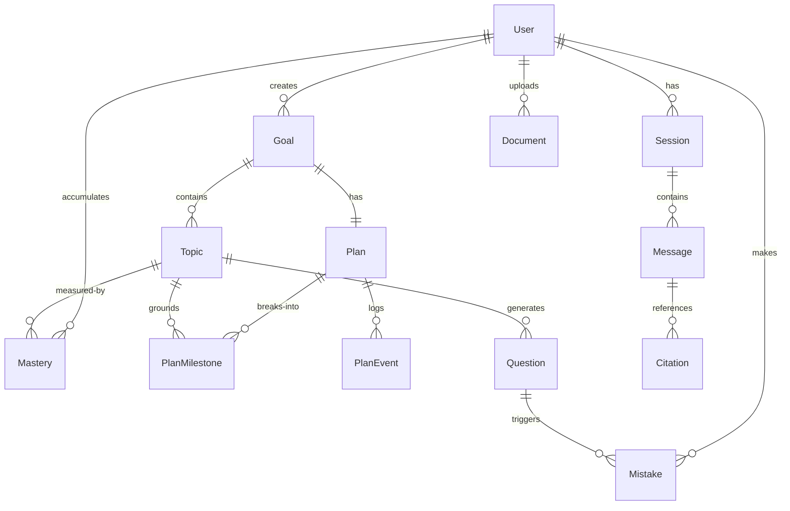

# Study Coach — ARCHITECTURE v2

> Portfolio-grade exam coach agent. FastAPI + LangGraph + Vue 3.
> Dual-track LLM configuration (local Ollama + cloud BYOK chat providers). Current automated baseline — 376 backend tests and 109 frontend tests (485 total); production build passing.

## 1. System Overview

```
                 ┌──────────────┐
    User Msg ──► │ MemoryHydr.  │ ─── load mastery / mistakes
                 └──────┬───────┘
                        ▼
                 ┌──────────────┐
                 │   Router     │ ─── classify intent
                 └──────┬───────┘
                        │
         ┌──────────────┼──────────────┬─────────────┐
         ▼              ▼              ▼             ▼
    ┌─────────┐   ┌──────────┐   ┌─────────┐   ┌───────────┐
    │ Planner │   │  Tutor   │   │  Quiz   │   │ Planner   │
    │ (det +  │   │          │   │ Master  │   │ Agent     │
    │  agent) │   └────┬─────┘   │(det+agt)│   │ (agent)   │
    └────┬────┘        │         └────┬────┘   └─────┬─────┘
         │             ▼              │              │
         │      ┌──────────┐          │              │
         └─────►│  Judge   │◄─────────┘──────────────┘
                │  Guard   │
                └────┬─────┘
                     ▼
              ┌──────────────┐
              │ MemoryWriter │ ─── persist mastery / mistakes
              └──────┬───────┘
                     ▼
              streamed output (SSE)
```

Backend: FastAPI + LangChain + LangGraph + Chroma hybrid retrieval + SQLAlchemy/Alembic.
Frontend: Vite + Vue 3 SPA + Pinia + Tailwind 4 + vue-i18n.
LLM: dual-track — BYOK cloud (OpenAI / Anthropic / Gemini) **or** local Ollama, switched per-request via headers.

**Current baseline (2026-07-28):** 376 backend tests and 109 frontend tests passing (485 total); frontend production build passing. The primary agent-loop matrices contain 792 records (P2.2 Plan 396 + P2.3 Quiz 396); the P2.3 no-retriever pilot adds 396, for 1,188 raw records total.

---

## 2. Entity-Relationship Diagram



- **User**: `id`, `fingerprint` (anonymous local identity), `google_id` / `email` (retained for the frozen, deferred OAuth backend), `created_at`
- **Goal**: one active goal per user (P2.1-③ invariant). `title`, `exam_date?`, `status` (active/done/abandoned)
- **Plan**: `milestones_json` (compatibility cache) + `PlanMilestone` normalized rows for stable progression
- **PlanEvent**: audit log of milestone state changes (created/completed/reopened/applied)
- **Mastery**: composite PK `(user_id, topic_id)`. Score 0..1 updated by quiz grading and mistake redo
- **Mistake**: SM-2 spaced-repetition schedule (`srs_due_at`, `srs_interval_days`, `srs_ease`)
- **Session** / **Message** / **Citation**: persisted chat history, assistant citations, and recoverable agent-run artifacts restored after frontend refresh

---

## 3. Architecture Decision Records

### ADR 1: LangGraph StateGraph vs Chain-of-Prompts

**Context:** HKBU original project used linear prompt chaining (HyDE → CoT plan → MCQ gen → Judge ablation). Each step was a standalone Python function with no shared state, no conditional routing, and no retry mechanism. The class report treated the chain as a black-box pipeline.

**Decision:** Adopt LangGraph `StateGraph` with a typed `CoachState` TypedDict and conditional edge routing. Nodes are: memory_hydrator → router → {tutor → judge, quiz_master, planner} → memory_writer.

**Consequences:**
- Isolated fault domains: a judge rejection retries only the tutor node, not the entire chain
- Partial-state testability: each node can be tested with a minimal state dict
- Checkpointer enables multi-turn session state across SSE requests
- Cost: ~200 lines of graph wiring boilerplate vs. ~50 lines of linear chain. The boilerplate pays off at >3 nodes with branching.
- Router intent classification is keyword-based (not LLM call) for deterministic latency. Agent loop ablation (P2.2/P2.3) showed deterministic routing + per-node mode dispatch is the right split for local models.

### ADR 2: SM-2 vs Leitner Box

**Context:** Quiz mistakes need spaced repetition scheduling. Leitner box (5 boxes, move up/down on correct/wrong) is simpler to explain; SM-2 (quality 0-5, ease factor, interval formula) is more granular.

**Decision:** SM-2 with a lite variant that derives repetition count implicitly from prior interval (0→1, 1→6, else *ease). Ease floor 1.3 per SM-2 spec. Quality ratings: wrong answer = 0 or 2, correct = 4 or 5, "mark understood" = 5.

**Consequences:**
- Continuous quality scores enable diagnostic precision (ease factor trends reveal topic difficulty)
- SM-2's `next_schedule()` is a pure function — testable without DB
- Lite variant avoids carrying an explicit `repetitions` column
- More complex than Leitner for a newcomer to understand; InfoPopover component mitigates this
- Quality=5 interval escalation (1d→6d→...→1070d) empirically verified in P4b manual testing

### ADR 3: Deterministic vs Agent Loop

**Context:** P2.2/P2.3 ran head-to-head ablations: deterministic state-machine Planner/QuizMaster vs. LLM tool-calling agent loop. 396 runs per experiment across 4 local models on 16GB Apple Silicon.

**Decision:** Conditional dispatch based on `x-planner-mode` / `x-quiz-mode` headers. Default is deterministic for production UX (predictable latency, 100% persistence). Agent loop is available for batch quality-max scenarios or cloud BYOK providers with reliable tool-calling.

**Consequences (from empirical data):**
- Agent loop adds 3-20× latency over deterministic on the same model
- Schema-as-harness is conditional on a 2D fit (schema-strictness × model-capability). Small models (qwen3.5:4b) fail with strict schemas at `max_iter=6`; lax schemas pass at 86%
- `gemma4:e4b` agent loop: 100% natural_stop, 94% persistence, 2.74 tool calls/run — champion
- `qwen2.5:7b` deterministic: tied quality with agent loop on local judge, 3× faster, 2.25× more persistent — "simplicity wins"
- Agent loop alignment safety net: tool-feedback channel (`retriever_search → "[]"`) gives well-aligned models a signal to decline fabrication. Deterministic prompt path lacks this channel
- See `docs/EVAL.md` and `docs/agent_loop_vs_deterministic.md` for full results

### ADR 4: SQLite-Only (with Postgres Migration Path)

**Context:** The ARCHITECTURE v1 spec called for SQLite/Postgres dual-adapter via SQLAlchemy. Portfolio demo needs zero-ops deployment.

**Decision:** SQLite for all environments. Repository layer returns SQLAlchemy `Session` objects — a Postgres migration is a connection string swap (`sqlite:///...` → `postgresql://...`) plus Alembic migration dialect review. No dual-DB sync bugs.

**Consequences:**
- Zero ops burden for Docker Compose demo (`docker compose up` includes SQLite volume)
- Cloud deployment remains deferred; the retained Fly files are an unverified scaffold, not a supported runtime topology
- Repository pattern isolates DB dialect: all queries use SQLAlchemy ORM, no raw SQL
- Alembic migrations use `batch_alter_table` for SQLite compatibility
- Alembic logging configuration preserves existing application loggers, so startup migrations do not disable Uvicorn access logs or exception tracebacks
- Trade-off: no concurrent writes, no connection pooling in production. Acceptable for portfolio demo; migration to Postgres is a env-var change when needed

### ADR 5: BYOK Header Pattern (Not Server-Wide Env)

**Context:** Users switch between local Ollama models and cloud providers (OpenAI, Anthropic, Gemini). A server-wide `OPENAI_API_KEY` env var would lock all users to one provider.

**Decision:** Per-request HTTP headers (`x-provider`, `x-model`, `x-api-key`, `x-base-url`, `x-judge-model`, `x-planner-mode`, `x-quiz-mode`). `init_chat_model()` called fresh per request. Frontend stores API keys in `localStorage`, sent via headers (never persisted server-side).

**Consequences:**
- Stateless: no server-side API key storage, no per-user provider configuration in DB
- Multi-model per session: judge can use a different model (`x-judge-model`) than the generator, mitigating self-preference bias (P2.1-② empirical: same-model bias delta ~0.20-0.40)
- Every request re-initializes the model object — acceptable for demo scale (~100ms overhead)
- `x-planner-mode` / `x-quiz-mode` extend the pattern for mode dispatch (ADR 3)
- Frontend `llmHeaders()` helper constructs headers from the settings store
- Settings hydration normalizes partial or invalid persisted objects against a complete default state. Anonymous token provisioning may create a token-only record before the Settings store exists; that record must still hydrate to a valid Ollama provider/model instead of sending `x-provider: undefined`.
- Local Ollama chat and embedding clients set `trust_env=False`, preventing process proxy settings from intercepting loopback/self-hosted Ollama traffic. Cloud-provider client configuration is unchanged.

### ADR 6: Single-User Local-First Instance Data Lifecycle

**Context:** Chroma, the live retriever, the LangGraph checkpointer, and SQLite are instance-wide resources. Presenting partial per-user deletion on top of the global Chroma collection would imply an ownership guarantee the storage model does not provide. P5 therefore needs an honest portfolio boundary and a recoverable reset path without claiming a distributed transaction.

**Decision:** P5 treats one running Study Coach deployment as a **single-user, local-first instance**.

- `GET /api/data/summary` and `POST /api/data/reset` require a valid signed bearer token through `require_signed_user`; these lifecycle routes never use the legacy `"default-user"` fallback.
- Reset is disabled by default (`STUDY_COACH_LOCAL_MODE=0`). The shipped Docker Compose configuration enables it and binds backend host traffic to `127.0.0.1:8000`; the deferred Fly scaffold keeps local mode off but is not a supported deployment. P5 does not enforce request source IP, so the environment flag and deployment binding are the security boundary.
- P5 supports one backend worker. The in-process lifecycle gate and object replacement are not a multi-worker coordination protocol.
- Learning operations and identity-mutating auth POST routes use a shared lease acquired by pure ASGI middleware **before** any request body is read, and held until the response (including SSE/StreamingResponse) completes. This closes the FastAPI multipart race where `UploadFile` parsing previously ran before request-scoped dependencies. `CORSMiddleware` is outermost so middleware-generated `409` conflict JSON still receives `Access-Control-*` headers; CORS does not read the request body, so this order does not reopen the multipart race. Read-only `/api/auth/config` remains available. Reset takes an exclusive lease and is excluded from the shared middleware path; conflicts return stable `409` codes (`reset_in_progress` or `data_operation_in_progress`). Disabled reset returns `403 reset_disabled`; stage failure returns retryable `500 reset_failed` with `failed_stage`. Once the destructive stage starts, failure leaves a scope-specific recovery latch: shared work and the other reset scope receive `409 reset_recovery_required`, while retrying the required scope is allowed. Frontend catch paths honor backend `required_scope` when latching Retry, so a factory request that receives `required_scope=learning` (or the reverse) switches pending/recovery scope instead of looping the wrong reset. Pre-destructive safe refusals (`data_operation_in_progress`, `reset_in_progress`, `reset_disabled`, `invalid_confirmation`, and auth/validation 401/422) do **not** latch recovery and remain cancelable. Mismatched confirmation text returns `422 invalid_confirmation`; an unsupported scope is rejected separately by ordinary Pydantic validation with `422`.
- Factory reset clears browser keys only after backend success, provisions one replacement anonymous identity with factory-default preferences, then broadcasts; peers invalidate in-flight provisioning continuations and reload. Ordinary anonymous provisioning captures the shared fingerprint at request start; writing the auth response requires both the tab-local generation and the shared fingerprint to still match, so a stale tab cannot resurrect a deleted token after another tab factory-resets.
- Duplicate PDF uploads for the same user + content hash keep one canonical filename: the existing SQL document filename when present, otherwise the current request filename. That chosen source is written authoritatively into Chroma and BM25 (including updates to already-indexed chunk IDs without growing counts). After `DocumentRepository.create()` returns, if a concurrent first-upload race made SQL keep a different winning filename, the route reconciles Chroma/BM25 to `doc.filename` before responding. `create()` recovers `IntegrityError` on `(user_id, hash)` the same way anonymous user provisioning recovers fingerprint races. `BM25Index.add_chunks` / `search` hold an `RLock` across snapshot→update/append→rebuild so concurrent identical adds cannot duplicate chunks or let search observe mismatched `_bm25` / `_chunks` lengths.
- Reset order is fixed: clear Chroma, rebuild and republish the **complete** retriever and replace the `InMemorySaver` checkpointer references, then execute one child-first SQLite transaction (`citations → messages → sessions`, `plan_events → plan_milestones → plans`, `mistakes/mastery/questions → topics → goals → documents`, then users for factory scope).
- This order provides idempotent recovery, not a cross-store transaction. If Chroma replacement or SQLite deletion fails after the destructive stage begins, the in-process recovery latch remains until the same scope completes. A retry observes any already-empty store and safely finishes the remaining deletion. The latch is intentionally single-process and is lost on backend restart, matching the one-worker P5 boundary.
- Strict bearer verification validates the signed token but does not require its user row to remain present. If a factory-reset success response is lost, the same still-valid token can therefore retry idempotently and receive a completed empty reset; this is accepted only inside the local-mode and loopback deployment boundary.

Two scopes share that backend ordering:

- `learning`: deletes all learning records, source chunks, vectors, retriever caches, and checkpoint state while preserving the local user row and browser model/provider/API/language/interface settings.
- `factory`: deletes the learning scope plus backend user rows; after backend success, the initiating tab clears shared browser identity/settings keys before broadcasting completion. Receiving tabs clear only their own session state and reload, so a delayed tab cannot delete the new shared identity. On the successful path, all tabs then reload into one anonymous first-run state. If initiating browser cleanup fails after backend completion, broadcast is still attempted and the initiating tab remains in the retryable error state rather than claiming completion.

Summary and reset responses expose the same 15 count fields: `users`, `documents`, `source_chunks`, `vectors`, `chat_sessions`, `messages`, `citations`, `goals`, `topics`, `plans`, `plan_milestones`, `plan_events`, `questions`, `mastery`, and `mistakes`. `source_chunks` is the sum of SQL `documents.chunks_count`; `vectors` is the live Chroma count, so interrupted operations and legacy/orphaned embeddings can make them differ. `has_learning_data` ignores a user row by itself but is true for any other learning row or vector.

**Consequences:** The startup gate, Settings Danger Zone, two-scope confirmations, cross-tab invalidation, and retry behavior can describe exactly what the current storage model does. The routed page is not mounted until the startup decision unlocks the workspace, so child lifecycle hooks cannot perform requests behind the gate. A reload during recovery reopens the blocking reset error with only the required-scope Retry action. Summary remains readable when reset is disabled, but `reset_enabled=false` makes the frontend skip the startup gate and hide the Danger Zone. A future per-user Chroma design must add ownership metadata and filtered retrieval throughout dense/BM25/reranking/tool paths **and replace this global-reset contract**; it cannot layer per-user deletion on the P5 coordinator unchanged.

---

## 4. Agent Graph Topology

```
START → memory_hydrator → router → conditional_edges →
  ├─ intent=tutor → tutor → judge → memory_writer → END
  ├─ intent=quiz  → quiz_master → judge → memory_writer → END
  └─ intent=plan  → planner → judge → memory_writer → END
```

| Node | Responsibility | Config injection |
|------|---------------|-----------------|
| `memory_hydrator` | Load `mastery_scores` + `recent_mistakes` from DB into state | `configurable.memory_hydrator` (no-op if absent) |
| `router_node` | Keyword classification: `quiz` > `plan` > `tutor`. State-aware overrides for `active_quiz_question_id` / `active_plan_id` | — |
| `tutor_node` | RAG-grounded answer with citations via hybrid+rerank retriever | `configurable.judge_llm` for downstream judge |
| `judge_node` | LLM-as-judge with rubric (6-dim tutor / 5-dim quiz / 5-dim plan). PDCA: up to 2 retries → degrade with disclaimer | Retry budget = 2, threshold = 0.6 |
| `quiz_master` | Deterministic state-machine (GENERATE→RAG-ground→generate_quiz; GRADE→rule-based) + agent_loop variant | `configurable.quiz_master` + `configurable.quiz_mode` |
| `planner_node` | Deterministic state-machine (GENERATE→milestones JSON→persist→?mindmap; CHECK-IN→progress→LLM adjust) + agent_loop variant | `configurable.planner` + `configurable.planner_mode` |
| `memory_writer` | Drain `pending_mastery_delta` + `pending_mistake` to DB | `configurable.memory_writer` (no-op if absent) |

Streaming: `/api/chat` first emits `{type:"session", session_id}` so the client can reuse the persisted chat session. Nodes then emit SSE events via `get_stream_writer()`: `{type:"trace"}`, `{type:"citations"}`, `{type:"token"}` and, for Planner / QuizMaster `agent_loop` runs, `{type:"agent_run", run}` before `{type:"done"}`. Routes read via `graph.astream(stream_mode="custom")`.

Checkpointer: `InMemorySaver` (process-lifetime) keeps active graph state such as in-flight quiz/plan context. SQL `sessions/messages/citations` persist displayable chat history across frontend refresh; `messages.tool_calls_json` stores a backwards-compatible assistant artifact envelope with citation source metadata and optional `agent_run`. Upgrade target for graph state: `SqliteSaver`.

Corpus guard: `/api/chat` checks SQL `documents` for the authenticated user before entering the graph. If the current user has no Library documents, it streams an upload prompt, persists the turn, and skips retrieval/LLM calls so stale global Chroma chunks cannot leak into answers.

Quiz strong consistency: Chat displays an answerable MCQ only after the backend has persisted the question and set `active_quiz_question_id`. The visible GENERATE reply is formatted from that persisted `Question` row rather than the model's final prose, so answer/explanation stay private until the deterministic GRADE turn. The Quiz persistence schema also removes a narrowly recognized trailing retrieval-metadata object (`source` / `page` / `score`) from explanations. Failed agent-loop persistence degrades to a non-answerable message while preserving redacted Agent Run evidence.

---

## 5. Tool Registry

| Tool | Input | Output | Side effect |
|------|-------|--------|-------------|
| `rag_search` | `query, top_k=5` | `chunks, citations` | read Chroma |
| `generate_quiz` | `topic, difficulty, n, context_chunks?` | `QuizOut(questions[])` | insert `questions` |
| `grade_quiz_answer` | `question_id, user_answer` | `GradeOut(correct, explanation, correct_answer)` | none |
| `record_mistake` | `question_id, user_answer` | `MistakeOut(mistake_id, srs_due_at)` | insert `mistakes` (SM-2) |
| `update_mastery` | `topic_id, delta` | `MasteryOut(new_score)` | upsert `mastery` |
| `update_study_plan` | `goal_id, milestones_json` | `PlanPatchOut(updated_at)` | upsert `plans` |
| `generate_mindmap` | `topic` | `MindmapOut(mermaid_src, markdown_outline)` | none |
| `retriever_search` | `query, top_k` | `chunks[]` | none (agent_loop LLM tool) |
| `persist_quiz_question` | `QuizQuestionPersist` | `question_id` | insert `questions` (agent_loop LLM tool) |

Tools 1-7 are used by deterministic nodes. Tools 8-9 are LLM-visible `@tool` wrappers for agent_loop mode. `plan` has parallel wrappers (`get_existing_plan`, `compute_progress`).

---

## 6. Database Schema

Key tables (full definition at `backend/app/db/models.py`):

| Table | Key columns | Notes |
|-------|------------|-------|
| `users` | `id, fingerprint, google_id?, email?` | Anonymous local identity; OAuth columns retained for deferred backend work |
| `goals` | `id, user_id, title, exam_date?, status` | One active goal per user |
| `topics` | `id, goal_id, name, source_chunks` | `source_chunks` = chunk_ids from last quiz grounding |
| `plans` | `id, goal_id, milestones_json, updated_at` | `milestones_json` = compatibility cache |
| `plan_milestones` | `id, plan_id, topic_id?, topic_name?, title, due_at?, done, sort_order, source` | Normalized milestone rows for stable progression; optional FK to topics |
| `plan_events` | `id, plan_id, milestone_id?, actor, action, before_json, after_json` | Audit log |
| `questions` | `id, topic_id, prompt, options_json, answer, explanation` | 4-option MCQ |
| `mastery` | `(user_id, topic_id) PK, score, last_reviewed` | 0..1, updated by quiz + mistake redo |
| `mistakes` | `id, user_id, question_id, srs_due_at, srs_interval_days, srs_ease` | SM-2 schedule |
| `sessions` | `id, user_id, started_at, summary?` | Persisted chat session (Python class: `ChatSession`) |
| `messages` | `id, session_id, role, content, tool_calls_json?` | Displayable chat turns restored after frontend refresh; `tool_calls_json` stores assistant artifacts |
| `citations` | `id, message_id, chunk_id, page, span_start, span_end` | Source citations attached to assistant messages |
| `documents` | `id, user_id, filename, hash, chunks_count` | Uploaded PDFs |

Chunks live in **Chroma** (collection `study_coach_chunks`), not in SQL.
SQL `documents` is the empty-corpus gate for retrieval: Chroma stores chunks, while the API refuses chat retrieval when the current user has no Library document rows. Full per-document Chroma filtering still requires adding `user_id` / `document_id` metadata to chunks and passing filters through dense, BM25, reranking, and agent-tool retrieval.

Assistant artifacts use schema `assistant_artifacts.v1`:

```json
{"schema":"assistant_artifacts.v1","citations":[],"agent_run":null}
```

Legacy rows where `tool_calls_json` is a plain citation list remain valid. `agent_run` is a UI-safe projection from `AgentTrace.serialize_public()`: node, mode, exit reason, iteration/tool counts, token counts, wall time, and redacted tool-call previews. Raw retriever outputs are summarized, not stored in the public trace payload.

Schema managed via **Alembic**. `migrate_to_head()` called on every `create_app()` — idempotent.

---

## 7. API Routes

| Method | Path | Auth | Response |
|--------|------|------|----------|
| GET | `/api/health` | none | `{status, ollama_enabled}` |
| GET | `/api/auth/config` | none | `{google_client_id}` (frozen backend-only OAuth config) |
| POST | `/api/auth/google` | none | `{access_token, user_id, tier:"member"}` |
| POST | `/api/auth/anonymous` | none | `{access_token, user_id, tier:"guest"}` |
| POST | `/api/auth/upgrade` | none | `{access_token, user_id, tier:"member"}` |
| POST | `/api/chat` | JWT/guest | SSE: `{type:"session"\|"trace"\|"citations"\|"token"\|"agent_run"\|"done"}` |
| GET | `/api/chat/sessions/current` | JWT/guest | `{session_id, started_at, summary}` |
| GET | `/api/chat/sessions/{id}/messages` | JWT/guest | `{session_id, messages:[{role, content, citations[], agent_run?}]}` |
| POST | `/api/documents` | JWT/guest | `{document_id, filename, chunks_count}` |
| GET | `/api/documents` | JWT/guest | `[{id, filename, chunks_count}]` |
| POST | `/api/goals` | JWT/guest | `{goal_id, title}` |
| GET | `/api/plans/current` | JWT/guest | `{plan_id, goal_id, milestones[], updated_at}` |
| PATCH | `/api/plans/{id}/milestones/{mid}` | JWT/guest | `{plan, event, validation_hint}` |
| PATCH | `/api/plans/{id}/milestones/reorder` | JWT/guest | `PlanCurrentOut` |
| GET | `/api/plans/{id}/events` | JWT/guest | `[PlanEventOut]` |
| GET | `/api/mistakes/due` | JWT/guest | `[{mistake_id, question, due_at, srs_*, topic_name}]` |
| POST | `/api/mistakes/{id}/review` | JWT/guest | `{correct, correct_answer, explanation, new_interval_days}` |
| POST | `/api/mistakes/{id}/mark-understood` | JWT/guest | `{mastery_score, next_due_at}` |
| GET | `/api/mastery` | JWT/guest | `{scores[], weak_topics[], overdue_count, streak_days, coverage}` |
| GET | `/api/users/me/stats` | JWT/guest | `{streak_days, coverage, total_sessions, last_active_date, activity_daily[]}` |
| GET | `/api/data/summary` | strict signed bearer | `{reset_enabled, has_learning_data, ...15 counts}` |
| POST | `/api/data/reset` | strict signed bearer + local mode | `{scope, status:"completed", deleted:{...15 counts}}` |
| GET | `/api/models/tool-check` | none | `{tool_capable, model, note}` |
| GET | `/api/models/ping` | none | `{ok, model, latency_ms, note}` |

All AI-bearing routes read **BYOK headers** (see §8) per request. Existing application routes use JWT Bearer through `get_current_user`, which retains a legacy `"default-user"` fallback for backward compatibility. Data summary/reset deliberately use `require_signed_user` and never fall back.

---

## 8. LLM Provider & BYOK Spec

| Header | Required | Default | Notes |
|--------|----------|---------|-------|
| `x-provider` | no | `ollama` | `openai` / `anthropic` / `google_genai` / `ollama` |
| `x-model` | no | `gemma3:4b` | provider-specific model id |
| `x-api-key` | unless ollama | — | never persisted server-side |
| `x-base-url` | no | provider default | self-hosted / proxy |
| `x-judge-model` | no | same as `x-model` | different model for Judge Guard |
| `x-planner-mode` | no | `deterministic` | `deterministic` or `agent_loop` |
| `x-quiz-mode` | no | `deterministic` | `deterministic` or `agent_loop` |

Tool-call detection: `GET /api/models/tool-check` probes model with dummy `ping` tool. `GET /api/models/ping` tests connectivity. Results cached per-model in `localStorage`.

---

## 9. Frontend Architecture

```
views/
├── Overview.vue       → useOverview (setup-store composing 4 stores)
├── Chat.vue           → useChat (SSE streaming + current session / agent run restore)
├── PlanTimeline.vue   → usePlan (milestones + MilestoneList + PlanGantt)
├── QuizAdaptive.vue   → useQuiz (adaptive quiz + MCQCard + GradeResult)
├── MistakeBank.vue    → useMistakes (SM-2 due + redo + mark-understood)
├── Library.vue        → useDocuments (upload + list)
├── Settings.vue       → useSettings + useDataLifecycle (BYOK preferences + capability-aware Danger Zone)
└── Onboarding.vue     → 3-step wizard (name → date → upload)

stores/               # Pinia — resource, lifecycle, notification, activity, and derived state
├── settings.ts        # provider/model/api_key (localStorage-persisted)
├── dataLifecycle.ts   # startup gate, two-scope reset, summary refresh, cross-tab lifecycle phase
├── activity.ts        # epoch-guarded activity heatmap state
├── notifications.ts   # app-level toast queue, including local learning-reset success
├── chat.ts            # current session, streaming buffer, trace[], assistant agentRun
├── plan.ts            # milestones, planId, fetch/patch
├── quiz.ts            # currentMCQ, lastGrade, generate/grade
├── mistakes.ts        # due list, redo state
├── mastery.ts         # scores, weak_topics
├── documents.ts       # uploaded documents
└── overview.ts        # derived: composes mastery + plan + mistakes + documents

components/           # shared UI plus root StartupDataGate / ResetConfirmDialog / ToastHost
composables/          # useMediaQuery (mobile detection)
locales/              # en.json, zh-CN.json (vue-i18n)
```

Responsive: `<768px` — sidebar replaced by MobileNav bottom tab bar, Chat/Quiz/Plan adapt layout. Other views keep desktop layout.

---

## 10. Deployment Topology

```
Primary (local demo):
  Docker Compose
  ├── backend  127.0.0.1:8000 (FastAPI + LangGraph + Chroma + SQLite)
  │   ├── STUDY_COACH_LOCAL_MODE=1
  │   ├── CHROMA_PATH=/app/data/chroma
  │   └── OLLAMA_HOST=http://ollama:11434
  ├── frontend 127.0.0.1:5173 (Vite dev server; proxy target http://backend:8000)
  └── ollama   127.0.0.1:11434 (nomic-embed-text + gemma3:4b + qwen2.5:7b pre-pulled)

Deferred cloud scaffold:
  fly.toml + Dockerfile.fly
  └── not a verified deployment path
      ├── STUDY_COACH_LOCAL_MODE=0
      ├── frontend static serving is not wired
      ├── final image/runtime packaging is not validated
      └── retrieval still requires an embedding-provider design
```

The clean no-cache Compose build reduced backend/frontend contexts from 384.90 MB / 263.59 MB to 47.96 kB / 4.77 kB. Runtime smoke verified frontend HTML, direct backend health, and the frontend-proxied health endpoint with HTTP 200. It did not verify Ollama embedding or generation. On a cold backend start, FastEmbed downloads about 1.1 GB of model data before health becomes ready.

---

## 11. Security Model

| Concern | Implementation |
|---------|---------------|
| Auth | Shipped frontend auto-provisions an anonymous signed JWT. Identity-mutating auth POST routes participate in the lifecycle shared lease. Google OAuth/upgrade routes and columns remain frozen in backend code, with no frontend login runtime or delivered account continuity. |
| Data lifecycle | Summary/reset require strict signed bearer auth; reset defaults off and supported local-mode configurations bind the backend to loopback. The shipped Compose configuration enforces that binding; no request-IP enforcement is promised. |
| API key storage | `x-api-key` never logged or persisted server-side; frontend `localStorage` (demo scope) |
| CORS | FastAPI `CORSMiddleware` — frontend origin only |
| SQL injection | SQLAlchemy ORM (parameterized queries) |
| Document upload | file size limit + `.pdf` extension whitelist |
| XSS | Vue 3 template escaping by default; no `v-html` on user content |

---

## 12. Performance Budgets

*(A-tier expansion — placeholders for production benchmarking)*

| Metric | Target | Notes |
|--------|--------|-------|
| Chat SSE first-byte | < 500ms | router + retrieval |
| Chat SSE time-to-done | < 15s | tutor + judge (2 retries max) |
| RAG retrieval (hybrid+rerank) | < 500ms | BM25 + Dense + RRF + cross-encoder |
| Agent loop wall time | < 30s | max_iter=6, local models |
| Quiz generation | < 5s | RAG-grounded, single question |

---

## 13. Observability & Monitoring

*(A-tier expansion — placeholders for production observability)*

- **OpenTelemetry traces**: span per graph node + LLM call
- **Metrics**: token usage per model, judge score distribution over time, agent_loop vs deterministic latency
- **Alerts**: Ollama unreachable, Chroma persistence warning, judge score below threshold trending
- **Dashboard**: Grafana board linking token cost + user activity + model health

---

## Future: Full JadeAI-Grade Expansion

- Performance budgets: define P95 targets, run load tests
- Observability: OpenTelemetry tracing, token usage dashboard
- Full ADR set: expand from 6 to 15+ (chunking strategy, reranker selection, Chroma vs pgvector, InMemorySaver → PostgresSaver, eval methodology)
- Multi-user data ownership: replace the global P5 reset with user/document metadata, filtered retrieval, cross-store migration, and per-user deletion semantics
- Rate limiting, API key rotation policy, refresh token flow
