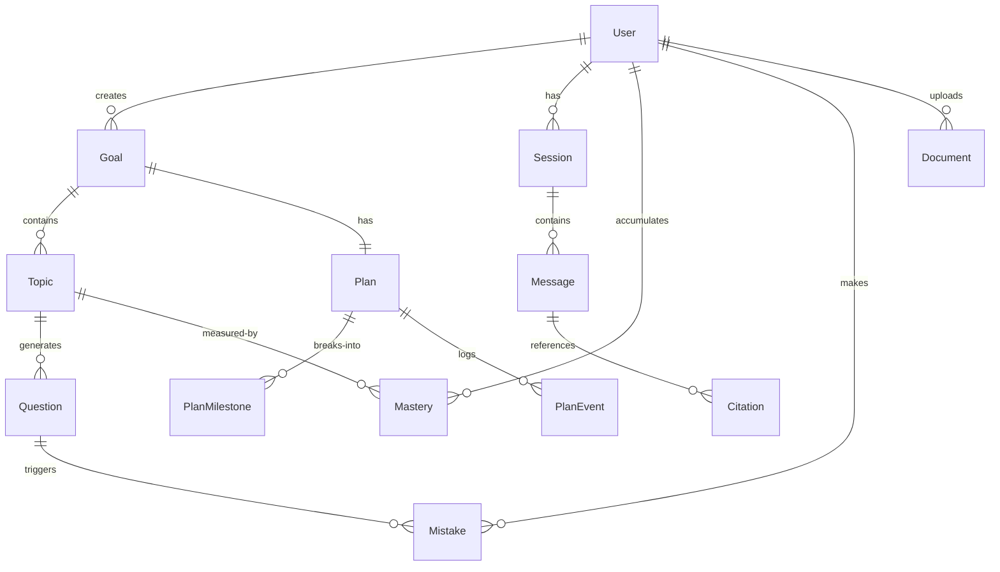

# Study Coach — ARCHITECTURE v2

> Portfolio-grade exam coach agent. FastAPI + LangGraph + Vue 3.
> Dual-track LLM (local Ollama + cloud BYOK). P4 shipped — 245 backend tests, frontend production build.

## 1. System Overview

```
                 ┌──────────────┐
    User Msg ──► │ MemoryHydr.  │ ─── load mastery / mistakes
                 └──────┬───────┘
                        ▼
                 ┌──────────────┐
                 │   Router     │ ─── classify intent
                 └──────┬───────┘
                        │
         ┌──────────────┼──────────────┬─────────────┐
         ▼              ▼              ▼             ▼
    ┌─────────┐   ┌──────────┐   ┌─────────┐   ┌───────────┐
    │ Planner │   │  Tutor   │   │  Quiz   │   │ Planner   │
    │ (det +  │   │          │   │ Master  │   │ Agent     │
    │  agent) │   └────┬─────┘   │(det+agt)│   │ (agent)   │
    └────┬────┘        │         └────┬────┘   └─────┬─────┘
         │             ▼              │              │
         │      ┌──────────┐          │              │
         └─────►│  Judge   │◄─────────┘──────────────┘
                │  Guard   │
                └────┬─────┘
                     ▼
              ┌──────────────┐
              │ MemoryWriter │ ─── persist mastery / mistakes
              └──────┬───────┘
                     ▼
              streamed output (SSE)
```

Backend: FastAPI + LangChain + LangGraph + Chroma hybrid retrieval + SQLAlchemy/Alembic.
Frontend: Vite + Vue 3 SPA + Pinia + Tailwind 4 + vue-i18n.
LLM: dual-track — BYOK cloud (OpenAI / Anthropic / Gemini) **or** local Ollama, switched per-request via headers.

**Current baseline (P4):** 245 backend tests, frontend build passing. Agent loop ablation data: 792 records across P2.2 (Plan) + P2.3 (Quiz).

---

## 2. Entity-Relationship Diagram



- **User**: `id`, `fingerprint` (FingerprintJS guest), `google_id` (OAuth member), `email`, `created_at`
- **Goal**: one active goal per user (P2.1-③ invariant). `title`, `exam_date?`, `status` (active/done/abandoned)
- **Plan**: `milestones_json` (compatibility cache) + `PlanMilestone` normalized rows for stable progression
- **PlanEvent**: audit log of milestone state changes (created/completed/reopened/applied)
- **Mastery**: composite PK `(user_id, topic_id)`. Score 0..1 updated by quiz grading and mistake redo
- **Mistake**: SM-2 spaced-repetition schedule (`srs_due_at`, `srs_interval_days`, `srs_ease`)
- **Session** / **Message** / **Citation**: chat persistence (schema present; write paths partial)

---

## 3. Architecture Decision Records

### ADR 1: LangGraph StateGraph vs Chain-of-Prompts

**Context:** HKBU original project used linear prompt chaining (HyDE → CoT plan → MCQ gen → Judge ablation). Each step was a standalone Python function with no shared state, no conditional routing, and no retry mechanism. The class report treated the chain as a black-box pipeline.

**Decision:** Adopt LangGraph `StateGraph` with a typed `CoachState` TypedDict and conditional edge routing. Nodes are: memory_hydrator → router → {tutor → judge, quiz_master, planner} → memory_writer.

**Consequences:**
- Isolated fault domains: a judge rejection retries only the tutor node, not the entire chain
- Partial-state testability: each node can be tested with a minimal state dict
- Checkpointer enables multi-turn session state across SSE requests
- Cost: ~200 lines of graph wiring boilerplate vs. ~50 lines of linear chain. The boilerplate pays off at >3 nodes with branching.
- Router intent classification is keyword-based (not LLM call) for deterministic latency. Agent loop ablation (P2.2/P2.3) showed deterministic routing + per-node mode dispatch is the right split for local models.

### ADR 2: SM-2 vs Leitner Box

**Context:** Quiz mistakes need spaced repetition scheduling. Leitner box (5 boxes, move up/down on correct/wrong) is simpler to explain; SM-2 (quality 0-5, ease factor, interval formula) is more granular.

**Decision:** SM-2 with a lite variant that derives repetition count implicitly from prior interval (0→1, 1→6, else *ease). Ease floor 1.3 per SM-2 spec. Quality ratings: wrong answer = 0 or 2, correct = 4 or 5, "mark understood" = 5.

**Consequences:**
- Continuous quality scores enable diagnostic precision (ease factor trends reveal topic difficulty)
- SM-2's `next_schedule()` is a pure function — testable without DB
- Lite variant avoids carrying an explicit `repetitions` column
- More complex than Leitner for a newcomer to understand; InfoPopover component mitigates this
- Quality=5 interval escalation (1d→6d→...→1070d) empirically verified in P4b manual testing

### ADR 3: Deterministic vs Agent Loop

**Context:** P2.2/P2.3 ran head-to-head ablations: deterministic state-machine Planner/QuizMaster vs. LLM tool-calling agent loop. 396 runs per experiment across 4 local models on 16GB Apple Silicon.

**Decision:** Conditional dispatch based on `x-planner-mode` / `x-quiz-mode` headers. Default is deterministic for production UX (predictable latency, 100% persistence). Agent loop is available for batch quality-max scenarios or cloud BYOK providers with reliable tool-calling.

**Consequences (from empirical data):**
- Agent loop adds 3-20× latency over deterministic on the same model
- Schema-as-harness is conditional on a 2D fit (schema-strictness × model-capability). Small models (qwen3.5:4b) fail with strict schemas at `max_iter=6`; lax schemas pass at 86%
- `gemma4:e4b` agent loop: 100% natural_stop, 94% persistence, 2.74 tool calls/run — champion
- `qwen2.5:7b` deterministic: tied quality with agent loop on local judge, 3× faster, 2.25× more persistent — "simplicity wins"
- Agent loop alignment safety net: tool-feedback channel (`retriever_search → "[]"`) gives well-aligned models a signal to decline fabrication. Deterministic prompt path lacks this channel
- See `docs/EVAL.md` and `docs/agent_loop_vs_deterministic.md` for full results

### ADR 4: SQLite-Only (with Postgres Migration Path)

**Context:** The ARCHITECTURE v1 spec called for SQLite/Postgres dual-adapter via SQLAlchemy. Portfolio demo needs zero-ops deployment.

**Decision:** SQLite for all environments. Repository layer returns SQLAlchemy `Session` objects — a Postgres migration is a connection string swap (`sqlite:///...` → `postgresql://...`) plus Alembic migration dialect review. No dual-DB sync bugs.

**Consequences:**
- Zero ops burden for Docker Compose demo (`docker compose up` includes SQLite volume)
- fly.io fallback uses SQLite on fly volume (sufficient for single-user portfolio traffic)
- Repository pattern isolates DB dialect: all queries use SQLAlchemy ORM, no raw SQL
- Alembic migrations use `batch_alter_table` for SQLite compatibility
- Trade-off: no concurrent writes, no connection pooling in production. Acceptable for portfolio demo; migration to Postgres is a env-var change when needed

### ADR 5: BYOK Header Pattern (Not Server-Wide Env)

**Context:** Users switch between local Ollama models and cloud providers (OpenAI, Anthropic, Gemini). A server-wide `OPENAI_API_KEY` env var would lock all users to one provider.

**Decision:** Per-request HTTP headers (`x-provider`, `x-model`, `x-api-key`, `x-base-url`, `x-judge-model`, `x-planner-mode`, `x-quiz-mode`). `init_chat_model()` called fresh per request. Frontend stores API keys in `localStorage`, sent via headers (never persisted server-side).

**Consequences:**
- Stateless: no server-side API key storage, no per-user provider configuration in DB
- Multi-model per session: judge can use a different model (`x-judge-model`) than the generator, mitigating self-preference bias (P2.1-② empirical: same-model bias delta ~0.20-0.40)
- Every request re-initializes the model object — acceptable for demo scale (~100ms overhead)
- `x-planner-mode` / `x-quiz-mode` extend the pattern for mode dispatch (ADR 3)
- Frontend `llmHeaders()` helper constructs headers from the settings store

---

## 4. Agent Graph Topology

```
START → memory_hydrator → router → conditional_edges →
  ├─ intent=tutor → tutor → judge → memory_writer → END
  ├─ intent=quiz  → quiz_master → judge → memory_writer → END
  └─ intent=plan  → planner → judge → memory_writer → END
```

| Node | Responsibility | Config injection |
|------|---------------|-----------------|
| `memory_hydrator` | Load `mastery_scores` + `recent_mistakes` from DB into state | `configurable.memory_hydrator` (no-op if absent) |
| `router_node` | Keyword classification: `quiz` > `plan` > `tutor`. State-aware overrides for `active_quiz_question_id` / `active_plan_id` | — |
| `tutor_node` | RAG-grounded answer with citations via hybrid+rerank retriever | `configurable.judge_llm` for downstream judge |
| `judge_node` | LLM-as-judge with rubric (6-dim tutor / 5-dim quiz / 5-dim plan). PDCA: up to 2 retries → degrade with disclaimer | Retry budget = 2, threshold = 0.6 |
| `quiz_master` | Deterministic state-machine (GENERATE→RAG-ground→generate_quiz; GRADE→rule-based) + agent_loop variant | `configurable.quiz_master` + `configurable.quiz_mode` |
| `planner_node` | Deterministic state-machine (GENERATE→milestones JSON→persist→?mindmap; CHECK-IN→progress→LLM adjust) + agent_loop variant | `configurable.planner` + `configurable.planner_mode` |
| `memory_writer` | Drain `pending_mastery_delta` + `pending_mistake` to DB | `configurable.memory_writer` (no-op if absent) |

Streaming: nodes emit SSE events via `get_stream_writer()`: `{type:"trace"} → {type:"citations"} → {type:"token"}+ → {type:"done"}`. Routes read via `graph.astream(stream_mode="custom")`.

Checkpointer: `InMemorySaver` (process-lifetime). Upgrade target: `SqliteSaver`.

---

## 5. Tool Registry

| Tool | Input | Output | Side effect |
|------|-------|--------|-------------|
| `rag_search` | `query, top_k=5` | `chunks, citations` | read Chroma |
| `generate_quiz` | `topic, difficulty, n, context_chunks?` | `QuizOut(questions[])` | insert `questions` |
| `grade_quiz_answer` | `question_id, user_answer` | `GradeOut(correct, explanation, correct_answer)` | none |
| `record_mistake` | `question_id, user_answer` | `MistakeOut(mistake_id, srs_due_at)` | insert `mistakes` (SM-2) |
| `update_mastery` | `topic_id, delta` | `MasteryOut(new_score)` | upsert `mastery` |
| `update_study_plan` | `goal_id, milestones_json` | `PlanPatchOut(updated_at)` | upsert `plans` |
| `generate_mindmap` | `topic` | `MindmapOut(mermaid_src, markdown_outline)` | none |
| `retriever_search` | `query, top_k` | `chunks[]` | none (agent_loop LLM tool) |
| `persist_quiz_question` | `QuizQuestionPersist` | `question_id` | insert `questions` (agent_loop LLM tool) |

Tools 1-7 are used by deterministic nodes. Tools 8-9 are LLM-visible `@tool` wrappers for agent_loop mode. `plan` has parallel wrappers (`get_existing_plan`, `compute_progress`).

---

## 6. Database Schema

Key tables (full definition at `backend/app/db/models.py`):

| Table | Key columns | Notes |
|-------|------------|-------|
| `users` | `id, fingerprint, google_id?, email?` | Guest (fingerprint) or member (Google OAuth) |
| `goals` | `id, user_id, title, exam_date?, status` | One active goal per user |
| `topics` | `id, goal_id, name, source_chunks` | `source_chunks` = chunk_ids from last quiz grounding |
| `plans` | `id, goal_id, milestones_json, updated_at` | `milestones_json` = compatibility cache |
| `plan_milestones` | `id, plan_id, title, due_at?, done, sort_order, source` | Normalized milestone rows for stable progression |
| `plan_events` | `id, plan_id, milestone_id?, actor, action, before_json, after_json` | Audit log |
| `questions` | `id, topic_id, prompt, options_json, answer, explanation` | 4-option MCQ |
| `mastery` | `(user_id, topic_id) PK, score, last_reviewed` | 0..1, updated by quiz + mistake redo |
| `mistakes` | `id, user_id, question_id, srs_due_at, srs_interval_days, srs_ease` | SM-2 schedule |
| `sessions` | `id, user_id, started_at, summary?` | Chat session (Python class: `ChatSession`) |
| `messages` | `id, session_id, role, content, tool_calls_json?` | Chat history |
| `citations` | `id, message_id, chunk_id, page, span_start, span_end` | Source citations |
| `documents` | `id, user_id, filename, hash, chunks_count` | Uploaded PDFs |

Chunks live in **Chroma** (collection `study_coach_chunks`), not in SQL.

Schema managed via **Alembic**. `migrate_to_head()` called on every `create_app()` — idempotent.

---

## 7. API Routes

| Method | Path | Auth | Response |
|--------|------|------|----------|
| GET | `/api/health` | none | `{status, ollama_enabled}` |
| POST | `/api/auth/google` | none | `{access_token, user_id, tier:"member"}` |
| POST | `/api/auth/anonymous` | none | `{access_token, user_id, tier:"guest"}` |
| POST | `/api/auth/upgrade` | none | `{access_token, user_id, tier:"member"}` |
| POST | `/api/chat` | JWT/guest | SSE: `{type:"trace"\|"citations"\|"token"\|"done"}` |
| POST | `/api/documents` | JWT/guest | `{document_id, filename, chunks_count}` |
| GET | `/api/documents` | JWT/guest | `[{id, filename, chunks_count}]` |
| POST | `/api/goals` | JWT/guest | `{goal_id, title}` |
| GET | `/api/plans/current` | JWT/guest | `{plan_id, goal_id, milestones[], updated_at}` |
| PATCH | `/api/plans/{id}/milestones/{mid}` | JWT/guest | `{plan, event, validation_hint}` |
| PATCH | `/api/plans/{id}/milestones/reorder` | JWT/guest | `PlanCurrentOut` |
| GET | `/api/plans/{id}/events` | JWT/guest | `[PlanEventOut]` |
| GET | `/api/mistakes/due` | JWT/guest | `[{mistake_id, question, due_at, srs_*, topic_name}]` |
| POST | `/api/mistakes/{id}/review` | JWT/guest | `{correct, correct_answer, explanation, new_interval_days}` |
| POST | `/api/mistakes/{id}/mark-understood` | JWT/guest | `{mastery_score, next_due_at}` |
| GET | `/api/mastery` | JWT/guest | `{scores[], weak_topics[], overdue_count, streak_days, coverage}` |
| GET | `/api/users/me/stats` | JWT/guest | `{streak_days, coverage, activity_daily[]}` |
| GET | `/api/models/tool-check` | none | `{tool_capable, model, note}` |
| GET | `/api/models/ping` | none | `{ok, model, latency_ms, note}` |

All AI-bearing routes read **BYOK headers** (see §8) per request. Auth is JWT Bearer (`get_current_user` dependency) with `"default-user"` fallback for backward compatibility.

---

## 8. LLM Provider & BYOK Spec

| Header | Required | Default | Notes |
|--------|----------|---------|-------|
| `x-provider` | no | `ollama` | `openai` / `anthropic` / `google_genai` / `ollama` |
| `x-model` | no | `gemma3:4b` | provider-specific model id |
| `x-api-key` | unless ollama | — | never persisted server-side |
| `x-base-url` | no | provider default | self-hosted / proxy |
| `x-judge-model` | no | same as `x-model` | different model for Judge Guard |
| `x-planner-mode` | no | `deterministic` | `deterministic` or `agent_loop` |
| `x-quiz-mode` | no | `deterministic` | `deterministic` or `agent_loop` |

Tool-call detection: `GET /api/models/tool-check` probes model with dummy `ping` tool. `GET /api/models/ping` tests connectivity. Results cached per-model in `localStorage`.

---

## 9. Frontend Architecture

```
views/
├── Overview.vue       → useOverviewStore (setup-store composing 4 stores)
├── Chat.vue           → useChatStore (SSE streaming + orderedParts)
├── PlanTimeline.vue   → usePlanStore (milestones + MilestoneList + PlanGantt)
├── QuizAdaptive.vue   → useQuizStore (adaptive quiz + MCQCard + GradeResult)
├── MistakeBank.vue    → useMistakesStore (SM-2 due + redo + mark-understood)
├── Library.vue        → useDocumentsStore (upload + list)
├── Settings.vue       → useSettingsStore (BYOK + debug mode + language)
└── Onboarding.vue     → 3-step wizard (name → date → upload)

stores/               # Pinia — 1 store per resource group + 1 derived
├── settings.ts        # provider/model/api_key (localStorage-persisted)
├── chat.ts            # current session, streaming buffer, trace[]
├── plan.ts            # milestones, planId, fetch/patch
├── quiz.ts            # currentMCQ, lastGrade, generate/grade
├── mistakes.ts        # due list, redo state
├── mastery.ts         # scores, weak_topics
├── documents.ts       # uploaded documents
├── overview.ts        # derived: composes mastery + plan + mistakes + documents
└── goal.ts            # active goal (for onboarding guard)

components/           # shared UI primitives + view-specific components
composables/          # useMediaQuery (mobile detection)
locales/              # en.json, zh-CN.json (vue-i18n)
```

Responsive: `<768px` — sidebar replaced by MobileNav bottom tab bar, Chat/Quiz/Plan adapt layout. Other views keep desktop layout.

---

## 10. Deployment Topology

```
Primary (local demo):
  Docker Compose
  ├── backend  :8000 (FastAPI + LangGraph + Chroma + SQLite)
  ├── frontend :5173 (Vite dev server)
  └── ollama   :11434 (gemma3:4b + qwen2.5:7b pre-pulled)

Fallback (cloud demo link):
  fly.io (HKG region)
  └── single container (backend + frontend static files)
      ├── OLLAMA_ENABLED=false
      ├── SQLite on fly volume
      └── BYOK cloud-only (no local model)
```

---

## 11. Security Model

| Concern | Implementation |
|---------|---------------|
| Auth | Google OAuth (member) / FingerprintJS (guest) → JWT Bearer |
| API key storage | `x-api-key` never logged or persisted server-side; frontend `localStorage` (demo scope) |
| CORS | FastAPI `CORSMiddleware` — frontend origin only |
| SQL injection | SQLAlchemy ORM (parameterized queries) |
| Document upload | file size limit + `.pdf` extension whitelist |
| XSS | Vue 3 template escaping by default; no `v-html` on user content |

---

## 12. Performance Budgets

*(A-tier expansion — placeholders for production benchmarking)*

| Metric | Target | Notes |
|--------|--------|-------|
| Chat SSE first-byte | < 500ms | router + retrieval |
| Chat SSE time-to-done | < 15s | tutor + judge (2 retries max) |
| RAG retrieval (hybrid+rerank) | < 500ms | BM25 + Dense + RRF + cross-encoder |
| Agent loop wall time | < 30s | max_iter=6, local models |
| Quiz generation | < 5s | RAG-grounded, single question |

---

## 13. Observability & Monitoring

*(A-tier expansion — placeholders for production observability)*

- **OpenTelemetry traces**: span per graph node + LLM call
- **Metrics**: token usage per model, judge score distribution over time, agent_loop vs deterministic latency
- **Alerts**: Ollama unreachable, Chroma persistence warning, judge score below threshold trending
- **Dashboard**: Grafana board linking token cost + user activity + model health

---

## Future: Full JadeAI-Grade Expansion

- Performance budgets: define P95 targets, run load tests
- Observability: OpenTelemetry tracing, token usage dashboard
- Full ADR set: expand from 5 to 15+ (chunking strategy, reranker selection, Chroma vs pgvector, InMemorySaver → PostgresSaver, eval methodology)
- Rate limiting, API key rotation policy, refresh token flow
