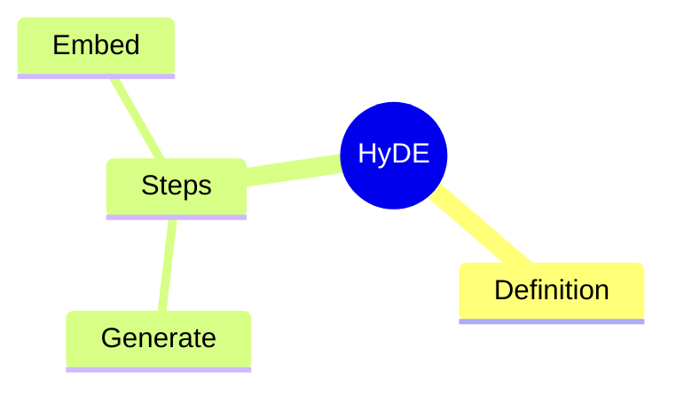

# P2.1-⑤ Plan Chain Implementation Plan

> **For agentic workers:** REQUIRED SUB-SKILL: Use superpowers:subagent-driven-development (recommended) or superpowers:executing-plans to implement this plan task-by-task. Steps use checkbox (`- [ ]`) syntax for tracking.

**Goal:** Land Planner + Reviewer nodes (`planner_node` + `judge_node` plan-rubric branch) and 2 tools (`update_study_plan` + `generate_mindmap`) so `/api/chat` handles "帮我做学习计划 on X" and multi-turn "进度怎么样了 / 把第三章拆两节" requests.

**Architecture:** Deterministic Planner node with GENERATE / CHECK-IN sub-paths (mirrors P2.1-④ QuizMaster). Reviewer is a new `intent="plan"` branch inside the existing `judge_node` (multi-rubric extension, no new node). State-aware router gets a third override (`active_plan_id` truthy → `intent="plan"`). All new graph wiring follows the established `RunnableConfig.configurable` injection pattern. Local Ollama (gemma3:4b) is the only validation surface; cloud (BYOK GPT/DeepSeek) adaptation points are marked with `# cloud-adapt:` comments but **not** implemented.

**Tech Stack:** Python 3.11 · FastAPI · LangChain · LangGraph 1.2.x · SQLAlchemy 2.x · Chroma · Pydantic 2.x · pytest (`asyncio_mode = "auto"`) · Ollama gemma3:4b.

**Baseline:** 124 backend tests passing. **Target:** 153 tests passing (+29 across 7 automated cuts).

**Spec:** `docs/superpowers/specs/2026-05-22-p2-1-5-plan-chain-design.md` (READ FIRST).

**Project notes (carry into every cut):**
- Project is **not a git repository** — replace all "commit" steps in the standard TDD loop with **`uv run pytest -q` full-suite run** to verify no regressions. Do not `git init`.
- All paths are relative to repo root `/Users/lianghaozhe/Downloads/Study Compaion and JadeAI/study-coach/`. Backend root: `backend/`. Test root: `backend/tests/`.
- Run pytest from `backend/`: `cd backend && uv run pytest -q` (or `uv run pytest tests/path/test_x.py::test_name -v`).
- Async tests do NOT need `@pytest.mark.asyncio` (configured via `asyncio_mode = "auto"` in `pyproject.toml`).
- Every new tool / node must follow the existing patterns: explicit repo args (no factory for stateless tools), `_safe_writer()` wrapper for `get_stream_writer()`, tolerant LLM-output JSON parsing.

---

## File Structure

**Create:**

| Path | Responsibility |
|---|---|
| `backend/app/agent/planner.py` | Deterministic Planner node factory (`build_planner`); decides GENERATE vs CHECK-IN, drives LLM + tools, returns state delta. |
| `backend/app/agent/tools/plan.py` | Two stateless functions: `update_study_plan` (DB upsert), `generate_mindmap` (LLM call with tolerant parsing). |
| `backend/app/agent/progress.py` | Pure function `compute_progress(plan, mastery_scores, recent_mistakes, now=None) → ProgressSummary`. Used by Planner CHECK-IN, no LLM, no DB. |
| `backend/app/agent/prompts/judge_plan.txt` | Plan judge rubric (5 dimensions) + bias-aware preamble + 2 calibrated few-shots. |
| `backend/app/agent/prompts/planner_generate.txt` | GENERATE-path system prompt (asks LLM for milestones JSON array given topic, chunks, mastery, exam_date). |
| `backend/app/agent/prompts/planner_check_in.txt` | CHECK-IN-path system prompt (asks LLM to adjust existing milestones given progress summary). |
| `backend/tests/agent/test_progress.py` | Cut ⑤a tests |
| `backend/tests/db/test_repositories_p2_1_5.py` | Cut ⑤b tests (PlanRepository.update_milestones) |
| `backend/tests/agent/tools/test_plan_tools.py` | Cut ⑤c tests |
| `backend/tests/agent/test_judge_plan_rubric.py` | Cut ⑤d tests |
| `backend/tests/agent/test_planner.py` | Cut ⑤e tests |
| `backend/tests/agent/test_graph_plan_e2e.py` | Cut ⑤f tests |
| `backend/tests/api/test_routes_plan.py` | Cut ⑤g tests |

**Modify:**

| Path | Why |
|---|---|
| `backend/app/agent/tools/schemas.py` | Add `Milestone`, `PlanPatchIn`, `PlanPatchOut`, `MindmapIn`, `MindmapOut`. |
| `backend/app/db/repositories.py` | Add `PlanRepository.update_milestones(goal_id, milestones)` upsert method. |
| `backend/app/agent/judge.py` | Add `PLAN_DIMENSIONS`, `load_plan_rubric()`. (No signature change to `judge_response`.) |
| `backend/app/agent/state.py` | Add `active_plan_id`, `plan_action` NotRequired fields. |
| `backend/app/agent/router.py` | (Optional) extend `PLAN_KEYWORDS` to include check-in verbs (`进度`, `check in`, `调整`). |
| `backend/app/agent/graph.py` | Replace `plan_stub_node` with `plan_node` delegator (mirrors `quiz_node`). Extend `router_node` state-aware override with `active_plan_id`. Extend `judge_node` rubric selection: `intent="plan" AND plan_action="generate"` → plan rubric; `plan_action="check_in"` → skip pass (mirror ④g grade-skip). Edge `plan → judge` replaces `plan_stub → memory_writer`. |
| `backend/app/api/deps.py` | Add `get_planner(...)` factory (session-scoped repos + retriever + llm). |
| `backend/app/api/routes.py` | Inject `planner` into `config["configurable"]`. |

---

## Cut ⑤a: `compute_progress` Pure Function

**Files:**
- Create: `backend/app/agent/progress.py`
- Test: `backend/tests/agent/test_progress.py`

Pure function over a `Plan` ORM-or-dict, mastery dict, and recent mistakes list. No LLM, no DB. TDD anchor for the cut.

- [ ] **Step 1: Write the failing test file**

Create `backend/tests/agent/test_progress.py`:

```python
"""Cut ⑤a — compute_progress pure function tests.

Inputs:
- plan: object with `.milestones_json: list[dict]` (each dict has `title`, optional
  `due_at: str|None` ISO date, `done: bool`, optional `topic: str`).
- mastery_scores: dict[topic_name, float 0..1]
- recent_mistakes: list[str] of mistake_ids (count only, not contents)
- now: datetime injection seam

Output: ProgressSummary dataclass with done_count / total_count / overdue / weak_topics
/ recent_mistake_count.
"""
from datetime import datetime
from types import SimpleNamespace

from app.agent.progress import ProgressSummary, compute_progress


def _plan(milestones):
    return SimpleNamespace(milestones_json=milestones)


def test_empty_plan_yields_zeros():
    summary = compute_progress(_plan([]), {}, [], now=datetime(2026, 5, 22))
    assert summary == ProgressSummary(
        done_count=0,
        total_count=0,
        overdue=[],
        weak_topics=[],
        recent_mistake_count=0,
    )


def test_all_done_no_overdue():
    milestones = [
        {"title": "M1", "due_at": "2026-05-01", "done": True},
        {"title": "M2", "due_at": "2026-05-02", "done": True},
    ]
    summary = compute_progress(_plan(milestones), {}, [], now=datetime(2026, 5, 22))
    assert summary.done_count == 2
    assert summary.total_count == 2
    assert summary.overdue == []


def test_overdue_detects_past_due_at_not_done():
    milestones = [
        {"title": "Past undone", "due_at": "2026-05-10", "done": False},
        {"title": "Past done",   "due_at": "2026-05-10", "done": True},
        {"title": "Future",      "due_at": "2026-06-10", "done": False},
        {"title": "No due_at",   "due_at": None,         "done": False},
    ]
    summary = compute_progress(_plan(milestones), {}, [], now=datetime(2026, 5, 22))
    assert [m["title"] for m in summary.overdue] == ["Past undone"]


def test_weak_topics_lists_mastery_below_threshold():
    summary = compute_progress(
        _plan([]),
        {"HyDE": 0.2, "BM25": 0.7, "RAG": 0.39},
        [],
        now=datetime(2026, 5, 22),
    )
    assert sorted(summary.weak_topics) == ["HyDE", "RAG"]


def test_recent_mistake_count_passthrough():
    summary = compute_progress(
        _plan([]),
        {},
        ["m1", "m2", "m3"],
        now=datetime(2026, 5, 22),
    )
    assert summary.recent_mistake_count == 3
```

- [ ] **Step 2: Run tests to verify they fail**

Run: `cd backend && uv run pytest tests/agent/test_progress.py -v`

Expected: 5 ERRORS / FAILs with `ModuleNotFoundError: No module named 'app.agent.progress'`.

- [ ] **Step 3: Implement `compute_progress`**

Create `backend/app/agent/progress.py`:

```python
"""Pure progress summary for Plan CHECK-IN path (P2.1-⑤).

No LLM, no DB. Inputs are arbitrary objects with a `.milestones_json` attribute
(typed loosely so SQLAlchemy `Plan` rows and ad-hoc dicts both work).
"""
from __future__ import annotations

from dataclasses import dataclass, field
from datetime import datetime
from typing import Any

_WEAK_MASTERY_THRESHOLD = 0.4


@dataclass(frozen=True)
class ProgressSummary:
    done_count: int
    total_count: int
    overdue: list[dict]
    weak_topics: list[str] = field(default_factory=list)
    recent_mistake_count: int = 0


def _parse_due(due_at: Any) -> datetime | None:
    if not due_at:
        return None
    if isinstance(due_at, datetime):
        return due_at
    # Tolerate "YYYY-MM-DD" or full ISO; fall back to None on garbage.
    try:
        return datetime.fromisoformat(str(due_at))
    except ValueError:
        return None


def compute_progress(
    plan,
    mastery_scores: dict[str, float],
    recent_mistakes: list[str],
    *,
    now: datetime | None = None,
) -> ProgressSummary:
    now = now or datetime.utcnow()
    milestones = list(getattr(plan, "milestones_json", []) or [])
    done = [m for m in milestones if m.get("done")]
    overdue = []
    for m in milestones:
        if m.get("done"):
            continue
        due = _parse_due(m.get("due_at"))
        if due is not None and due < now:
            overdue.append(m)
    weak_topics = [name for name, score in mastery_scores.items() if score < _WEAK_MASTERY_THRESHOLD]
    return ProgressSummary(
        done_count=len(done),
        total_count=len(milestones),
        overdue=overdue,
        weak_topics=weak_topics,
        recent_mistake_count=len(recent_mistakes),
    )
```

- [ ] **Step 4: Run tests to verify they pass**

Run: `cd backend && uv run pytest tests/agent/test_progress.py -v`

Expected: `5 passed`.

- [ ] **Step 5: Full-suite checkpoint**

Run: `cd backend && uv run pytest -q`

Expected: `129 passed` (124 baseline + 5).

---

## Cut ⑤b: `PlanRepository.update_milestones`

**Files:**
- Modify: `backend/app/db/repositories.py` (PlanRepository, ~line 135-153)
- Test: `backend/tests/db/test_repositories_p2_1_5.py`

Add an upsert method: if a `Plan` exists for the goal, overwrite `milestones_json` + bump `updated_at`; else create.

- [ ] **Step 1: Write the failing test file**

Create `backend/tests/db/test_repositories_p2_1_5.py`:

```python
"""Cut ⑤b — PlanRepository.update_milestones upsert tests."""
from datetime import datetime

import pytest
from sqlalchemy import create_engine
from sqlalchemy.orm import Session
from sqlalchemy.pool import StaticPool

from app.db.models import Base
from app.db.repositories import GoalRepository, PlanRepository, UserRepository


@pytest.fixture
def session():
    engine = create_engine(
        "sqlite:///:memory:",
        connect_args={"check_same_thread": False},
        poolclass=StaticPool,
        echo=False,
    )
    Base.metadata.create_all(engine)
    with Session(engine) as s:
        yield s


def test_update_milestones_creates_plan_when_absent(session):
    user = UserRepository(session).get_or_create("fp-plan-create")
    goal = GoalRepository(session).create(user_id=user.id, title="G")
    repo = PlanRepository(session)

    plan = repo.update_milestones(
        goal_id=goal.id,
        milestones=[{"title": "Read §1", "due_at": "2026-05-30", "done": False, "topic": "HyDE"}],
    )

    assert plan.goal_id == goal.id
    assert len(plan.milestones_json) == 1
    assert plan.milestones_json[0]["title"] == "Read §1"
    assert isinstance(plan.updated_at, datetime)
    # Singleton: get_by_goal sees the new row
    fetched = repo.get_by_goal(goal.id)
    assert fetched.id == plan.id


def test_update_milestones_overwrites_existing_and_bumps_updated_at(session):
    user = UserRepository(session).get_or_create("fp-plan-upsert")
    goal = GoalRepository(session).create(user_id=user.id, title="G")
    repo = PlanRepository(session)
    original = repo.create(
        goal_id=goal.id,
        milestones_json=[{"title": "old", "done": False}],
    )
    old_updated = original.updated_at

    # Force a tick so updated_at advances on SQLite second-precision clocks.
    import time
    time.sleep(0.01)

    updated = repo.update_milestones(
        goal_id=goal.id,
        milestones=[{"title": "new", "done": True}],
    )

    assert updated.id == original.id  # same row, not a new one
    assert len(updated.milestones_json) == 1
    assert updated.milestones_json[0]["title"] == "new"
    assert updated.updated_at >= old_updated
```

- [ ] **Step 2: Run tests to verify they fail**

Run: `cd backend && uv run pytest tests/db/test_repositories_p2_1_5.py -v`

Expected: 2 FAILs with `AttributeError: 'PlanRepository' object has no attribute 'update_milestones'`.

- [ ] **Step 3: Add the method to `PlanRepository`**

Edit `backend/app/db/repositories.py` — find the existing `PlanRepository` class (around line 135) and add `update_milestones` after `get_by_goal`:

```python
    def update_milestones(self, *, goal_id: str, milestones: list) -> Plan:
        """Upsert: overwrite milestones_json on the goal's plan, else create."""
        existing = self.get_by_goal(goal_id)
        if existing is None:
            return self.create(goal_id=goal_id, milestones_json=milestones)
        existing.milestones_json = list(milestones)
        existing.updated_at = datetime.utcnow()
        self.session.commit()
        self.session.refresh(existing)
        return existing
```

- [ ] **Step 4: Run tests to verify they pass**

Run: `cd backend && uv run pytest tests/db/test_repositories_p2_1_5.py -v`

Expected: `2 passed`.

- [ ] **Step 5: Full-suite checkpoint**

Run: `cd backend && uv run pytest -q`

Expected: `131 passed` (129 + 2).

---

## Cut ⑤c: Plan Tools (`update_study_plan` + `generate_mindmap`)

**Files:**
- Modify: `backend/app/agent/tools/schemas.py` (append new schemas)
- Create: `backend/app/agent/tools/plan.py`
- Test: `backend/tests/agent/tools/test_plan_tools.py`

Two stateless functions following the quiz-tools pattern: explicit repo arg (for `update_study_plan`) and explicit `llm` arg (for `generate_mindmap`). Tolerant LLM-output parsing for the mindmap (mermaid fence → bare → outline-only fallback).

- [ ] **Step 1: Add Pydantic schemas**

Append to `backend/app/agent/tools/schemas.py`:

```python
# --- update_study_plan -------------------------------------------------------

class Milestone(BaseModel):
    title: str
    due_at: str | None = None      # ISO date "YYYY-MM-DD" or None
    done: bool = False
    topic: str | None = None


class PlanPatchIn(BaseModel):
    goal_id: str
    milestones: list[Milestone]


class PlanPatchOut(BaseModel):
    plan_id: str
    updated_at: datetime


# --- generate_mindmap --------------------------------------------------------

class MindmapIn(BaseModel):
    topic: str
    milestones: list[Milestone]


class MindmapOut(BaseModel):
    mermaid_src: str               # "" when LLM output couldn't be parsed
    markdown_outline: str
```

- [ ] **Step 2: Write the failing test file**

Create `backend/tests/agent/tools/test_plan_tools.py`:

```python
"""Cut ⑤c — Plan tool tests.

`update_study_plan` is a thin wrapper around PlanRepository.update_milestones —
the repo upsert is already covered by Cut ⑤b, so we only assert the contract here.
`generate_mindmap` is an LLM-driven tool; we stub the LLM and check the three
tolerant parsing tiers + fallback.
"""
import pytest
from langchain_core.messages import AIMessage
from sqlalchemy import create_engine
from sqlalchemy.orm import Session
from sqlalchemy.pool import StaticPool

from app.agent.tools.plan import generate_mindmap, update_study_plan
from app.agent.tools.schemas import Milestone
from app.db.models import Base
from app.db.repositories import GoalRepository, PlanRepository, UserRepository


@pytest.fixture
def session():
    engine = create_engine(
        "sqlite:///:memory:",
        connect_args={"check_same_thread": False},
        poolclass=StaticPool,
        echo=False,
    )
    Base.metadata.create_all(engine)
    with Session(engine) as s:
        yield s


class StubLLM:
    def __init__(self, response_text: str):
        self.response_text = response_text
        self.last_prompt: str | None = None

    async def ainvoke(self, messages, **_kwargs):
        self.last_prompt = messages[-1].content if messages else ""
        return AIMessage(content=self.response_text)


def test_update_study_plan_persists_milestones(session):
    user = UserRepository(session).get_or_create("fp-tool-plan")
    goal = GoalRepository(session).create(user_id=user.id, title="G")
    repo = PlanRepository(session)

    out = update_study_plan(
        goal_id=goal.id,
        milestones=[Milestone(title="Read §1", due_at="2026-05-30", done=False, topic="HyDE")],
        plan_repo=repo,
    )

    assert out.plan_id
    fetched = repo.get_by_goal(goal.id)
    assert fetched.milestones_json[0]["title"] == "Read §1"
    assert fetched.milestones_json[0]["due_at"] == "2026-05-30"


async def test_generate_mindmap_parses_fenced_mermaid():
    llm = StubLLM("""Here you go:

And outline:
- HyDE
  - Definition
  - Steps
""")
    out = await generate_mindmap(
        topic="HyDE",
        milestones=[Milestone(title="Read §1")],
        llm=llm,
    )

    assert "mindmap" in out.mermaid_src
    assert "root((HyDE))" in out.mermaid_src
    assert "HyDE" in out.markdown_outline


async def test_generate_mindmap_parses_bare_mermaid_without_fence():
    llm = StubLLM("""mindmap
  root((HyDE))
    Definition

Outline:
- HyDE
  - Definition
""")
    out = await generate_mindmap(
        topic="HyDE",
        milestones=[Milestone(title="Read §1")],
        llm=llm,
    )

    assert out.mermaid_src.startswith("mindmap")
    assert "HyDE" in out.markdown_outline


async def test_generate_mindmap_falls_back_to_outline_only_when_mermaid_unparseable():
    llm = StubLLM("Sorry, I can't draw a chart, but here's the outline:\n- HyDE\n  - Step 1")
    out = await generate_mindmap(
        topic="HyDE",
        milestones=[Milestone(title="Read §1")],
        llm=llm,
    )

    assert out.mermaid_src == ""
    # Outline is whatever survived parsing (we don't strictly require leading bullets,
    # only that some text reaches the user instead of crashing).
    assert out.markdown_outline.strip() != ""


async def test_generate_mindmap_llm_failure_returns_empty_mermaid():
    class CrashLLM:
        async def ainvoke(self, messages, **_kwargs):
            raise RuntimeError("ollama unreachable")

    out = await generate_mindmap(
        topic="HyDE",
        milestones=[Milestone(title="Read §1")],
        llm=CrashLLM(),
    )

    assert out.mermaid_src == ""
    assert "HyDE" in out.markdown_outline  # uses milestones as fallback outline
```

- [ ] **Step 3: Run tests to verify they fail**

Run: `cd backend && uv run pytest tests/agent/tools/test_plan_tools.py -v`

Expected: 5 ERRORS with `ModuleNotFoundError: No module named 'app.agent.tools.plan'`.

- [ ] **Step 4: Implement `plan.py`**

Create `backend/app/agent/tools/plan.py`:

```python
"""Plan tool chain (ARCHITECTURE.md §3, rows `update_study_plan` and `generate_mindmap`).

Two plain functions: `update_study_plan` (sync DB upsert) and `generate_mindmap`
(async LLM call). Stateless; explicit repo / llm args. No LangGraph imports.
"""
import re

from langchain_core.messages import HumanMessage

from app.db.repositories import PlanRepository

from .schemas import MindmapOut, PlanPatchOut, Milestone


_MERMAID_FENCE_RE = re.compile(r"```(?:mermaid)?\s*(mindmap.*?)```", re.DOTALL | re.IGNORECASE)
_MERMAID_BARE_RE = re.compile(r"(mindmap[\s\S]+?)(?:\n\n|\Z)", re.IGNORECASE)

_MINDMAP_PROMPT = """You are a study-plan mindmap generator.

Topic: {topic}

Milestones:
{milestone_lines}

Output two parts:

1. A valid mermaid `mindmap` block wrapped in ```mermaid fences, root labelled with the topic, branches for each milestone.
2. After the fence, a markdown bullet outline of the same structure.

Do NOT add any other commentary.
"""


def _milestone_lines(milestones: list[Milestone]) -> str:
    return "\n".join(f"- {m.title}" for m in milestones) or "- (no milestones)"


def _fallback_outline(topic: str, milestones: list[Milestone]) -> str:
    bullets = "\n".join(f"  - {m.title}" for m in milestones) or "  - (no milestones)"
    return f"- {topic}\n{bullets}"


def update_study_plan(
    *,
    goal_id: str,
    milestones: list[Milestone],
    plan_repo: PlanRepository,
) -> PlanPatchOut:
    milestone_dicts = [m.model_dump() for m in milestones]
    plan = plan_repo.update_milestones(goal_id=goal_id, milestones=milestone_dicts)
    return PlanPatchOut(plan_id=plan.id, updated_at=plan.updated_at)


async def generate_mindmap(
    *,
    topic: str,
    milestones: list[Milestone],
    llm,
) -> MindmapOut:
    prompt = _MINDMAP_PROMPT.format(
        topic=topic,
        milestone_lines=_milestone_lines(milestones),
    )
    try:
        response = await llm.ainvoke([HumanMessage(content=prompt)])
        raw = getattr(response, "content", "") or ""
    except Exception:
        # cloud-adapt: cloud LLMs rarely crash here; the fallback keeps gemma3:4b stable.
        return MindmapOut(mermaid_src="", markdown_outline=_fallback_outline(topic, milestones))

    mermaid_src = ""
    fence = _MERMAID_FENCE_RE.search(raw)
    if fence:
        mermaid_src = fence.group(1).strip()
    else:
        bare = _MERMAID_BARE_RE.search(raw)
        if bare:
            mermaid_src = bare.group(1).strip()

    # Outline = whatever the LLM emitted minus the mermaid block; on failure, derive from milestones.
    outline = re.sub(r"```mermaid[\s\S]*?```", "", raw, flags=re.IGNORECASE).strip()
    if not outline:
        outline = _fallback_outline(topic, milestones)

    return MindmapOut(mermaid_src=mermaid_src, markdown_outline=outline)
```

- [ ] **Step 5: Run tests to verify they pass**

Run: `cd backend && uv run pytest tests/agent/tools/test_plan_tools.py -v`

Expected: `5 passed`.

- [ ] **Step 6: Full-suite checkpoint**

Run: `cd backend && uv run pytest -q`

Expected: `136 passed` (131 + 5).

---

## Cut ⑤d: Plan Judge Rubric (`PLAN_DIMENSIONS` + `load_plan_rubric` + judge extension)

**Files:**
- Create: `backend/app/agent/prompts/judge_plan.txt`
- Modify: `backend/app/agent/judge.py` (add constant + loader)
- Test: `backend/tests/agent/test_judge_plan_rubric.py`

Add plan rubric content + loader. **No** change to `judge_response` signature or `_normalise` (the `dimensions` kwarg added in ④d already supports arbitrary tuples).

- [ ] **Step 1: Author the rubric text file**

Create `backend/app/agent/prompts/judge_plan.txt`:

```text
You are an impartial Study Coach judge evaluating a study plan that a Planner produced for a student.

**Student's request**: {question}

**Available Context** (source material that informed the plan, may be empty):
{context}

**Plan output to evaluate** (markdown milestones, possibly mermaid mindmap):
{answer}

---

## Bias-aware instruction (read first)

Evaluate critically. Do NOT inflate scores because the plan is well-formatted or matches your generation style. Watch for: (a) vague milestones ("study X" without scope), (b) all milestones on the exam date or all without due_at, (c) repetitive milestones covering the same sub-topic three times, (d) no link between weak mastery topics and milestone coverage.

---

## Rubric

Rate each dimension from 1 to 5 (integer). Five dimensions, equally weighted.

1. **milestone_specificity** (1-5): Are individual milestones concrete and actionable?
   - 1 = vague ("review math", "study chapter")
   - 5 = each milestone names a specific section, deliverable, or skill

2. **milestone_granularity** (1-5): Is the milestone count and chunk size sensible for the topic?
   - 1 = single mega-block OR >10 shallow tasks OR wildly uneven
   - 5 = 3-7 milestones with similar effort each

3. **time_feasibility** (1-5): Are the due_at dates sensible relative to today and any exam_date?
   - 1 = all stacked on one day, all None, or any due before today
   - 5 = evenly distributed with the hardest items earlier and review near the exam

4. **topic_coverage** (1-5): Does the plan address the weakest mastery topics (if any) and the user's stated subject?
   - 1 = ignores stated weak topics or pads with off-topic items
   - 5 = explicit milestones aimed at weak areas + the requested subject

5. **actionability** (1-5): After reading, does the student know what to do next?
   - 1 = empty motivational phrases ("study hard", "focus")
   - 5 = each milestone implies a clear next action

---

## Few-shot calibration

Example A (strong plan):
- Request: "Make me a 2-week plan for HyDE"
- Plan: "1. Read HyDE §1-§2 by 2026-05-25\n2. Implement HyDEGenerator stub by 2026-05-28\n3. Compare HyDE vs BM25 on Topic7 corpus by 2026-06-01\n4. Write 1-page summary by 2026-06-05"
- Scores: milestone_specificity=5, milestone_granularity=5, time_feasibility=5, topic_coverage=4, actionability=5

Example B (weak plan):
- Request: "Make me a 2-week plan for HyDE"
- Plan: "1. Study HyDE\n2. Practice\n3. Review"
- Scores: milestone_specificity=1, milestone_granularity=2, time_feasibility=1, topic_coverage=2, actionability=1

---

## Output format

Output **only** valid JSON, nothing else (no markdown fences, no prose preamble):

{{
    "milestone_specificity": <1-5>,
    "milestone_granularity": <1-5>,
    "time_feasibility": <1-5>,
    "topic_coverage": <1-5>,
    "actionability": <1-5>,
    "reasoning": "<one or two sentences citing the weakest dimension>"
}}
```

- [ ] **Step 2: Write the failing test file**

Create `backend/tests/agent/test_judge_plan_rubric.py`:

```python
"""Cut ⑤d — Plan judge rubric: dimensions + loader + scoring."""
from langchain_core.messages import AIMessage

from app.agent.judge import (
    PLAN_DIMENSIONS,
    QUIZ_DIMENSIONS,
    _DIMENSIONS as TUTOR_DIMENSIONS,
    judge_response,
    load_plan_rubric,
)


class StubJudgeLLM:
    def __init__(self, response_text: str):
        self.response_text = response_text

    async def ainvoke(self, messages, **_kwargs):
        return AIMessage(content=self.response_text)


def test_plan_dimensions_are_five_and_disjoint_from_tutor_and_quiz():
    assert len(PLAN_DIMENSIONS) == 5
    plan_set = set(PLAN_DIMENSIONS)
    assert plan_set.isdisjoint(TUTOR_DIMENSIONS)
    assert plan_set.isdisjoint(QUIZ_DIMENSIONS)


def test_load_plan_rubric_returns_template_with_placeholders():
    text = load_plan_rubric()
    assert "{question}" in text
    assert "{context}" in text
    assert "{answer}" in text
    for dim in PLAN_DIMENSIONS:
        assert dim in text


async def test_judge_response_with_plan_dims_strong_plan_passes():
    llm = StubJudgeLLM(
        '{"milestone_specificity": 5, "milestone_granularity": 5, '
        '"time_feasibility": 5, "topic_coverage": 4, "actionability": 5, '
        '"reasoning": "well scoped"}'
    )
    result = await judge_response(
        question="Make a plan",
        answer="...",
        context="",
        rubric=load_plan_rubric(),
        judge_llm=llm,
        dimensions=PLAN_DIMENSIONS,
    )
    assert result["verdict"] == "pass"
    assert result["weak_dims"] == []


async def test_judge_response_with_plan_dims_weak_plan_flags_weak_dims():
    llm = StubJudgeLLM(
        '{"milestone_specificity": 1, "milestone_granularity": 2, '
        '"time_feasibility": 1, "topic_coverage": 2, "actionability": 1, '
        '"reasoning": "vague"}'
    )
    result = await judge_response(
        question="Make a plan",
        answer="...",
        context="",
        rubric=load_plan_rubric(),
        judge_llm=llm,
        dimensions=PLAN_DIMENSIONS,
    )
    assert result["verdict"] == "weak"
    assert "milestone_specificity" in result["weak_dims"]
    assert "actionability" in result["weak_dims"]
```

- [ ] **Step 3: Run tests to verify they fail**

Run: `cd backend && uv run pytest tests/agent/test_judge_plan_rubric.py -v`

Expected: 4 errors with `ImportError: cannot import name 'PLAN_DIMENSIONS'` or `cannot import name 'load_plan_rubric'`.

- [ ] **Step 4: Add `PLAN_DIMENSIONS` + `load_plan_rubric` to `judge.py`**

Edit `backend/app/agent/judge.py`:

After the `QUIZ_DIMENSIONS = (...)` block (around line 43), insert:

```python
# P2.1-⑤ Plan judge dimensions: focuses on milestone quality (specificity /
# granularity / time feasibility / topic coverage / actionability).
PLAN_DIMENSIONS: tuple[str, ...] = (
    "milestone_specificity",
    "milestone_granularity",
    "time_feasibility",
    "topic_coverage",
    "actionability",
)
```

Next to `load_quiz_rubric` (around line 62), add:

```python
def load_plan_rubric() -> str:
    """Return the Plan judge prompt template (P2.1-⑤)."""
    path = Path(__file__).parent / "prompts" / "judge_plan.txt"
    return path.read_text(encoding="utf-8")
```

- [ ] **Step 5: Run tests to verify they pass**

Run: `cd backend && uv run pytest tests/agent/test_judge_plan_rubric.py -v`

Expected: `4 passed`.

- [ ] **Step 6: Full-suite checkpoint**

Run: `cd backend && uv run pytest -q`

Expected: `140 passed` (136 + 4).

---

## Cut ⑤e: `planner_node` (GENERATE + CHECK-IN)

**Files:**
- Create: `backend/app/agent/planner.py`
- Create: `backend/app/agent/prompts/planner_generate.txt`
- Create: `backend/app/agent/prompts/planner_check_in.txt`
- Modify: `backend/app/agent/state.py` (add `active_plan_id`, `plan_action`)
- Test: `backend/tests/agent/test_planner.py`

Deterministic factory `build_planner(...)` returning an async node. Mirror `quiz_master.py` style closely.

- [ ] **Step 1: Extend `CoachState` with plan fields**

Edit `backend/app/agent/state.py` — append inside `CoachState`:

```python
    # P2.1-⑤ Plan
    active_plan_id: NotRequired[str | None]
    plan_action: NotRequired[Literal["generate", "check_in"]]
```

(`Literal` is already imported at the top of the file; verify before saving.)

- [ ] **Step 2: Author the GENERATE prompt template**

Create `backend/app/agent/prompts/planner_generate.txt`:

```text
You are a study-plan generator for an exam coach.

Subject: {topic}
{context_section}
Student weak topics (mastery < 0.4): {weak_topics}
Exam date (optional): {exam_date}
Today: {today}

Generate 3 to 7 milestones as a JSON array. Each milestone:
- title: short, concrete, actionable (≤ 12 words)
- due_at: ISO date "YYYY-MM-DD" between today and exam_date (or null if no exam_date)
- done: false
- topic: a sub-topic string (or null)

Distribute due_at dates evenly. Cover the weak topics if any. GROUND in the source chunks if provided.

Output ONLY a JSON array, no prose, no fences.
```

- [ ] **Step 3: Author the CHECK-IN prompt template**

Create `backend/app/agent/prompts/planner_check_in.txt`:

```text
You are a study-plan adjuster for an exam coach.

Current milestones (JSON):
{current_milestones}

Progress summary:
- Done: {done_count} / {total_count}
- Overdue (titles): {overdue_titles}
- Weak topics (mastery < 0.4): {weak_topics}
- Recent mistakes: {recent_mistake_count}

User's check-in message: {user_msg}

Adjust the milestones. You MAY:
- Mark items done if the user said so.
- Reorder.
- Add at most 2 new milestones aimed at weak topics.
- Postpone overdue items (push due_at later).
You may NOT delete existing milestones or rewrite titles beyond minor edits.

Output ONLY the updated JSON array, no prose, no fences. Schema same as input.
```

- [ ] **Step 4: Write the failing test file**

Create `backend/tests/agent/test_planner.py`:

```python
"""Cut ⑤e — planner_node tests (GENERATE + CHECK-IN).

Mirrors test_quiz_master.py: factory built with real in-memory SQLite repos,
LLM stubbed. Exercises both decide() paths + edge cases.
"""
from datetime import datetime

import pytest
from langchain_core.messages import AIMessage, HumanMessage
from sqlalchemy import create_engine
from sqlalchemy.orm import Session
from sqlalchemy.pool import StaticPool

from app.agent.planner import build_planner
from app.db.models import Base
from app.db.repositories import (
    GoalRepository,
    MasteryRepository,
    MistakeRepository,
    PlanRepository,
    UserRepository,
)


_GEN_JSON = """[
  {"title": "Read HyDE §1-§3", "due_at": "2026-05-25", "done": false, "topic": "HyDE"},
  {"title": "Implement HyDEGenerator", "due_at": "2026-05-28", "done": false, "topic": "HyDE"},
  {"title": "Compare HyDE vs BM25", "due_at": "2026-06-01", "done": false, "topic": "HyDE"}
]"""

_CHECK_IN_JSON = """[
  {"title": "Read HyDE §1-§3", "due_at": "2026-05-25", "done": true, "topic": "HyDE"},
  {"title": "Implement HyDEGenerator", "due_at": "2026-05-30", "done": false, "topic": "HyDE"},
  {"title": "Compare HyDE vs BM25", "due_at": "2026-06-03", "done": false, "topic": "HyDE"},
  {"title": "Review weak BM25 chapter", "due_at": "2026-06-05", "done": false, "topic": "BM25"}
]"""


class StubPlannerLLM:
    def __init__(self, response_text: str = _GEN_JSON):
        self.response_text = response_text
        self.last_prompt: str | None = None

    async def ainvoke(self, messages, **_kwargs):
        self.last_prompt = messages[-1].content if messages else ""
        return AIMessage(content=self.response_text)


class StubRetriever:
    def __init__(self, chunks=None):
        self.chunks = chunks or []
        self.last_query: str | None = None

    def search(self, query, top_k=5):
        self.last_query = query
        return self.chunks[:top_k]


@pytest.fixture
def session():
    engine = create_engine(
        "sqlite:///:memory:",
        connect_args={"check_same_thread": False},
        poolclass=StaticPool,
        echo=False,
    )
    Base.metadata.create_all(engine)
    with Session(engine) as s:
        yield s


def _build_node(session, llm=None, retriever=None):
    return build_planner(
        llm=llm or StubPlannerLLM(),
        plan_repo=PlanRepository(session),
        goal_repo=GoalRepository(session),
        mastery_repo=MasteryRepository(session),
        mistake_repo=MistakeRepository(session),
        retriever=retriever,
        now_fn=lambda: datetime(2026, 5, 22, 12, 0),
    )


async def test_planner_generate_creates_plan_and_sets_active_plan_id(session):
    user = UserRepository(session).get_or_create("fp-plan-gen")
    node = _build_node(session)

    update = await node({
        "messages": [HumanMessage(content="帮我做学习计划 on HyDE")],
        "user_id": user.id,
    })

    assert update["plan_action"] == "generate"
    assert update["active_plan_id"]
    # Plan row created
    plan_repo = PlanRepository(session)
    goal = GoalRepository(session).list_active_for_user(user.id)[0]
    saved = plan_repo.get_by_goal(goal.id)
    assert saved is not None
    assert len(saved.milestones_json) == 3
    # Output text mentions milestones
    text = update["messages"][0].content
    assert "Read HyDE" in text


async def test_planner_generate_skips_mindmap_without_keyword(session):
    user = UserRepository(session).get_or_create("fp-plan-no-mm")
    node = _build_node(session)

    update = await node({
        "messages": [HumanMessage(content="帮我做学习计划 on HyDE")],
        "user_id": user.id,
    })

    text = update["messages"][0].content
    assert "mindmap" not in text.lower()
    assert "```" not in text  # no mermaid fence


async def test_planner_generate_calls_mindmap_on_keyword(session):
    user = UserRepository(session).get_or_create("fp-plan-mm")

    # Sequence two stub responses: first call = milestones JSON, second = mindmap text.
    class TwoStepLLM:
        def __init__(self):
            self.calls = 0

        async def ainvoke(self, messages, **_kwargs):
            self.calls += 1
            if self.calls == 1:
                return AIMessage(content=_GEN_JSON)
            return AIMessage(content="```mermaid\nmindmap\n  root((HyDE))\n```\n- HyDE")

    llm = TwoStepLLM()
    node = _build_node(session, llm=llm)

    update = await node({
        "messages": [HumanMessage(content="帮我做学习计划 on HyDE 画脑图")],
        "user_id": user.id,
    })

    assert llm.calls == 2
    text = update["messages"][0].content
    assert "mindmap" in text.lower()


async def test_planner_generate_uses_retriever_chunks_in_prompt(session):
    user = UserRepository(session).get_or_create("fp-plan-rag")
    retriever = StubRetriever(chunks=[
        {"chunk_id": "t7:p1", "content": "HyDE = Hypothetical Document Embedding."},
    ])
    llm = StubPlannerLLM()
    node = _build_node(session, llm=llm, retriever=retriever)

    await node({
        "messages": [HumanMessage(content="帮我做学习计划 on HyDE")],
        "user_id": user.id,
    })

    assert retriever.last_query == "HyDE"
    assert "Hypothetical Document Embedding" in llm.last_prompt


async def test_planner_check_in_adjusts_existing_plan(session):
    user = UserRepository(session).get_or_create("fp-plan-ci")
    goal = GoalRepository(session).create(user_id=user.id, title="G")
    plan_repo = PlanRepository(session)
    initial = plan_repo.create(
        goal_id=goal.id,
        milestones_json=[
            {"title": "Read HyDE §1-§3", "due_at": "2026-05-25", "done": False, "topic": "HyDE"},
            {"title": "Implement HyDEGenerator", "due_at": "2026-05-28", "done": False, "topic": "HyDE"},
            {"title": "Compare HyDE vs BM25", "due_at": "2026-06-01", "done": False, "topic": "HyDE"},
        ],
    )
    llm = StubPlannerLLM(_CHECK_IN_JSON)
    node = _build_node(session, llm=llm)

    update = await node({
        "messages": [HumanMessage(content="进度怎么样了")],
        "user_id": user.id,
        "active_plan_id": initial.id,
        "mastery_scores": {"BM25": 0.2, "HyDE": 0.6},
    })

    assert update["plan_action"] == "check_in"
    refreshed = plan_repo.get_by_goal(goal.id)
    assert len(refreshed.milestones_json) == 4  # added BM25 review
    assert any(m["title"].startswith("Review weak BM25") for m in refreshed.milestones_json)
    text = update["messages"][0].content
    assert "Done:" in text or "进度" in text  # progress card surfaced


async def test_planner_check_in_with_unparseable_llm_output_keeps_plan_and_notes_skip(session):
    user = UserRepository(session).get_or_create("fp-plan-ci-bad")
    goal = GoalRepository(session).create(user_id=user.id, title="G")
    plan_repo = PlanRepository(session)
    initial = plan_repo.create(
        goal_id=goal.id,
        milestones_json=[{"title": "Read HyDE §1-§3", "due_at": "2026-05-25", "done": False, "topic": "HyDE"}],
    )
    llm = StubPlannerLLM(response_text="Sorry, I cannot do that today.")
    node = _build_node(session, llm=llm)

    update = await node({
        "messages": [HumanMessage(content="进度怎么样了")],
        "user_id": user.id,
        "active_plan_id": initial.id,
        "mastery_scores": {},
    })

    refreshed = plan_repo.get_by_goal(goal.id)
    assert len(refreshed.milestones_json) == 1  # unchanged
    text = update["messages"][0].content
    assert "Auto-adjust skipped" in text


async def test_planner_check_in_falls_back_to_generate_when_plan_missing(session):
    """active_plan_id set but plan was deleted externally → recover via GENERATE path."""
    user = UserRepository(session).get_or_create("fp-plan-recover")
    node = _build_node(session)

    update = await node({
        "messages": [HumanMessage(content="帮我做学习计划 on HyDE")],
        "user_id": user.id,
        "active_plan_id": "deadbeef-not-in-db",
    })

    # GENERATE took over; new plan created
    assert update["plan_action"] == "generate"
    assert update["active_plan_id"] != "deadbeef-not-in-db"
```

- [ ] **Step 5: Run tests to verify they fail**

Run: `cd backend && uv run pytest tests/agent/test_planner.py -v`

Expected: 7 errors with `ModuleNotFoundError: No module named 'app.agent.planner'`.

- [ ] **Step 6: Implement `planner.py`**

Create `backend/app/agent/planner.py`:

```python
"""Planner — deterministic node for P2.1-⑤ Plan chain.

State machine (mirrors P2.1-④ QuizMaster):
  - active_plan_id absent OR points to a missing plan → GENERATE
  - active_plan_id present + plan in DB                → CHECK-IN

GENERATE: extract topic, resolve/create goal, RAG-ground via retriever, ask LLM
for milestones JSON, persist via `update_study_plan`, optionally call
`generate_mindmap` when the user message contains a mindmap keyword.

CHECK-IN: read existing plan, compute deterministic progress summary, ask LLM
to adjust milestones, validate schema, persist if valid, format progress card.

Why deterministic (not LLM tool-calling) — same reason as QuizMaster: stable
baseline on small Ollama models; LLM tool-calling variant deferred to P2.2/P3.
"""
from __future__ import annotations

import json
import re
from datetime import date, datetime
from pathlib import Path
from typing import Callable

from langchain_core.messages import AIMessage, HumanMessage
from langgraph.config import get_stream_writer
from pydantic import ValidationError

from app.db.repositories import (
    GoalRepository,
    MasteryRepository,
    MistakeRepository,
    PlanRepository,
)

from .progress import ProgressSummary, compute_progress
from .state import CoachState
from .tools.plan import generate_mindmap, update_study_plan
from .tools.schemas import Milestone


_DEFAULT_GOAL_TITLE = "Default Study Goal"

_TOPIC_PATTERNS = [
    re.compile(r"学习计划.*on\s*(.+)", re.IGNORECASE),
    re.compile(r"帮我做.*学习计划.*on\s*(.+)", re.IGNORECASE),
    re.compile(r"plan.*on\s+(.+)", re.IGNORECASE),
    re.compile(r"plan\s+(?:for|for\s+studying)\s+(.+)", re.IGNORECASE),
    re.compile(r"复习计划.*on\s*(.+)", re.IGNORECASE),
]
_MINDMAP_KEYWORDS = ("脑图", "mindmap", "mind map", "脑图", "思维导图")
_CHECK_IN_KEYWORDS = ("进度", "怎么样了", "check in", "check-in", "调整", "拆", "重排")
_ARRAY_FENCE_RE = re.compile(r"```(?:json)?\s*(\[.*?\])\s*```", re.DOTALL)
_ARRAY_BARE_RE = re.compile(r"\[.*\]", re.DOTALL)

_PROMPTS_DIR = Path(__file__).parent / "prompts"


def _safe_writer():
    try:
        return get_stream_writer()
    except RuntimeError:
        return lambda _payload: None


def _extract_topic(text: str) -> str:
    for pattern in _TOPIC_PATTERNS:
        m = pattern.search(text)
        if m:
            return m.group(1).strip().rstrip("?!?.,。！画脑图mindmap ")
    return text.strip()


def _has_mindmap_keyword(text: str) -> bool:
    lowered = text.lower()
    return any(kw in lowered for kw in _MINDMAP_KEYWORDS)


def _has_check_in_keyword(text: str) -> bool:
    lowered = text.lower()
    return any(kw in lowered for kw in _CHECK_IN_KEYWORDS)


def _parse_milestones_json(raw: str) -> list[Milestone]:
    fence = _ARRAY_FENCE_RE.search(raw)
    if fence:
        candidate = fence.group(1)
    else:
        bare = _ARRAY_BARE_RE.search(raw)
        if not bare:
            return []
        candidate = bare.group(0)
    try:
        parsed = json.loads(candidate)
    except json.JSONDecodeError:
        return []
    if not isinstance(parsed, list):
        return []
    out: list[Milestone] = []
    for item in parsed:
        try:
            out.append(Milestone.model_validate(item))
        except ValidationError:
            continue
    return out


def _format_chunks(chunks: list[dict]) -> str:
    if not chunks:
        return "(no source chunks)"
    return "\n".join(f"[{i + 1}] {c.get('content', '')}" for i, c in enumerate(chunks))


def _format_generate_prompt(
    *,
    topic: str,
    chunks: list[dict],
    weak_topics: list[str],
    exam_date,
    today: date,
) -> str:
    template = (_PROMPTS_DIR / "planner_generate.txt").read_text(encoding="utf-8")
    context_section = ""
    if chunks:
        context_section = "Source chunks:\n" + _format_chunks(chunks) + "\n"
    return template.format(
        topic=topic,
        context_section=context_section,
        weak_topics=", ".join(weak_topics) if weak_topics else "(none)",
        exam_date=exam_date.isoformat() if exam_date else "(none)",
        today=today.isoformat(),
    )


def _format_check_in_prompt(
    *,
    current_milestones: list,
    progress: ProgressSummary,
    user_msg: str,
) -> str:
    template = (_PROMPTS_DIR / "planner_check_in.txt").read_text(encoding="utf-8")
    return template.format(
        current_milestones=json.dumps(current_milestones, ensure_ascii=False),
        done_count=progress.done_count,
        total_count=progress.total_count,
        overdue_titles=", ".join(m.get("title", "") for m in progress.overdue) or "(none)",
        weak_topics=", ".join(progress.weak_topics) if progress.weak_topics else "(none)",
        recent_mistake_count=progress.recent_mistake_count,
        user_msg=user_msg,
    )


def _format_milestones_md(milestones: list[Milestone]) -> str:
    lines = []
    for i, m in enumerate(milestones, start=1):
        check = "[x]" if m.done else "[ ]"
        due = f" — due {m.due_at}" if m.due_at else ""
        topic = f" *({m.topic})*" if m.topic else ""
        lines.append(f"{i}. {check} {m.title}{due}{topic}")
    return "\n".join(lines)


def _format_plan_output(milestones: list[Milestone], mindmap=None) -> str:
    parts = ["📋 **Study Plan**", "", _format_milestones_md(milestones)]
    if mindmap and mindmap.mermaid_src:
        parts += ["", "```mermaid", mindmap.mermaid_src, "```"]
    if mindmap and mindmap.markdown_outline:
        parts += ["", "**Outline**", mindmap.markdown_outline]
    return "\n".join(parts)


def _format_check_in_output(milestones: list[Milestone], progress: ProgressSummary) -> str:
    parts = [
        "📊 **Progress Check-in**",
        f"- Done: {progress.done_count} / {progress.total_count}",
    ]
    if progress.overdue:
        titles = ", ".join(m.get("title", "") for m in progress.overdue)
        parts.append(f"- Overdue: {titles}")
    if progress.weak_topics:
        parts.append(f"- Weak topics: {', '.join(progress.weak_topics)}")
    if progress.recent_mistake_count:
        parts.append(f"- Recent mistakes: {progress.recent_mistake_count}")
    parts += ["", "**Updated Plan**", _format_milestones_md(milestones)]
    return "\n".join(parts)


def build_planner(
    *,
    llm,
    plan_repo: PlanRepository,
    goal_repo: GoalRepository,
    mastery_repo: MasteryRepository,
    mistake_repo: MistakeRepository,
    retriever=None,
    now_fn: Callable[[], datetime] = datetime.utcnow,
):
    async def planner_node(state: CoachState) -> dict:
        writer = _safe_writer()
        user_id = state.get("user_id")
        user_msgs = [m for m in state["messages"] if isinstance(m, HumanMessage)]
        user_msg = user_msgs[-1].content if user_msgs else ""

        if not user_id:
            err = "Sign in (provide x-fingerprint header) to use the planner."
            writer({"type": "citations", "citations": []})
            writer({"type": "token", "text": err})
            return {"messages": [AIMessage(content=err)], "citations": []}

        active_plan_id = state.get("active_plan_id")
        existing_plan = None
        if active_plan_id:
            active_goals = goal_repo.list_active_for_user(user_id)
            if active_goals:
                existing_plan = plan_repo.get_by_goal(active_goals[0].id)
                # cloud-adapt: a richer plan ownership check could disambiguate multiple goals.

        # ---------- CHECK-IN ----------
        if existing_plan is not None:
            mastery_scores = state.get("mastery_scores", {}) or {}
            recent_mistakes = state.get("recent_mistakes", []) or []
            progress = compute_progress(
                existing_plan, mastery_scores, recent_mistakes, now=now_fn(),
            )
            prompt = _format_check_in_prompt(
                current_milestones=existing_plan.milestones_json,
                progress=progress,
                user_msg=user_msg,
            )
            try:
                response = await llm.ainvoke([HumanMessage(content=prompt)])
                raw = getattr(response, "content", "") or ""
            except Exception:
                raw = ""
            adjusted = _parse_milestones_json(raw)
            skip_note = ""
            if adjusted:
                patch = update_study_plan(
                    goal_id=existing_plan.goal_id,
                    milestones=adjusted,
                    plan_repo=plan_repo,
                )
                plan_id = patch.plan_id
                final_milestones = adjusted
            else:
                # cloud-adapt: cloud LLMs rarely fail schema; gemma3:4b is the reason we keep this branch.
                plan_id = existing_plan.id
                final_milestones = [Milestone.model_validate(m) for m in existing_plan.milestones_json]
                skip_note = "\n\n⚠️ Auto-adjust skipped: model output didn't match plan schema."

            text = _format_check_in_output(final_milestones, progress) + skip_note
            writer({"type": "citations", "citations": []})
            writer({"type": "token", "text": text})
            return {
                "messages": [AIMessage(content=text)],
                "citations": [],
                "active_plan_id": plan_id,
                "plan_action": "check_in",
                "last_context": "",
            }

        # ---------- GENERATE (or recover from stale active_plan_id) ----------
        topic = _extract_topic(user_msg)
        active = goal_repo.list_active_for_user(user_id)
        goal = active[0] if active else goal_repo.create(
            user_id=user_id, title=_DEFAULT_GOAL_TITLE,
        )

        chunks: list[dict] = []
        if retriever is not None:
            chunks = retriever.search(topic, top_k=5) or []

        mastery_scores = state.get("mastery_scores", {}) or {}
        weak_topics = [name for name, score in mastery_scores.items() if score < 0.4]
        prompt = _format_generate_prompt(
            topic=topic,
            chunks=chunks,
            weak_topics=weak_topics,
            exam_date=goal.exam_date,
            today=now_fn().date(),
        )
        response = await llm.ainvoke([HumanMessage(content=prompt)])
        raw = getattr(response, "content", "") or ""
        milestones = _parse_milestones_json(raw)
        if not milestones:
            err = f"Couldn't draft a plan on '{topic}'. Try a clearer goal."
            writer({"type": "citations", "citations": []})
            writer({"type": "token", "text": err})
            return {"messages": [AIMessage(content=err)], "citations": []}

        patch = update_study_plan(
            goal_id=goal.id, milestones=milestones, plan_repo=plan_repo,
        )

        mindmap = None
        # cloud-adapt: when provider=cloud, can pass mindmap_default=True via dep injection.
        if _has_mindmap_keyword(user_msg):
            try:
                mindmap = await generate_mindmap(
                    topic=topic, milestones=milestones, llm=llm,
                )
            except Exception:
                mindmap = None

        text = _format_plan_output(milestones, mindmap)
        writer({"type": "citations", "citations": []})
        writer({"type": "token", "text": text})
        return {
            "messages": [AIMessage(content=text)],
            "citations": [],
            "active_plan_id": patch.plan_id,
            "plan_action": "generate",
            "last_context": _format_chunks(chunks),
        }

    return planner_node
```

- [ ] **Step 7: Run tests to verify they pass**

Run: `cd backend && uv run pytest tests/agent/test_planner.py -v`

Expected: `7 passed`.

If a test fails on regex topic extraction, inspect `_extract_topic` regex order — most-specific patterns first.

- [ ] **Step 8: Full-suite checkpoint**

Run: `cd backend && uv run pytest -q`

Expected: `147 passed` (140 + 7).

---

## Cut ⑤f: Graph Wiring + State-Aware Router + Judge plan-rubric Branch

**Files:**
- Modify: `backend/app/agent/graph.py`
- Modify: `backend/app/agent/router.py` (extend `PLAN_KEYWORDS`)
- Test: `backend/tests/agent/test_graph_plan_e2e.py`

Replace `plan_stub_node` with real `plan_node` delegator. Extend `router_node` state-aware override (`active_plan_id` → intent=plan). Extend `judge_node` rubric selection + GRADE-skip pattern for `plan_action == "check_in"`. Wire edge `plan → judge` (replacing `plan_stub → memory_writer`).

- [ ] **Step 1: Extend `PLAN_KEYWORDS` so check-in messages route to plan**

Edit `backend/app/agent/router.py`:

```python
PLAN_KEYWORDS: tuple[str, ...] = (
    "plan",
    "计划",
    "目标",
    "复习计划",
    "schedule",
    "学习计划",
    # P2.1-⑤ — check-in / edit phrasing so router catches second-turn messages
    # even without an `active_plan_id` (defense-in-depth; state-aware override
    # handles the in-flight case).
    "进度",
    "check in",
    "check-in",
    "调整",
)
```

- [ ] **Step 2: Write the failing test file**

Create `backend/tests/agent/test_graph_plan_e2e.py`:

```python
"""Cut ⑤f — Graph e2e for the Plan branch.

Exercises router state-aware override + planner injection + judge plan rubric
+ memory_writer no-op. LLM and judge are stubbed; nothing hits Ollama.
"""
from datetime import datetime

import pytest
from langchain_core.messages import AIMessage, HumanMessage
from sqlalchemy import create_engine
from sqlalchemy.orm import Session
from sqlalchemy.pool import StaticPool

from app.agent.graph import build_graph
from app.agent.planner import build_planner
from app.db.models import Base
from app.db.repositories import (
    GoalRepository,
    MasteryRepository,
    MistakeRepository,
    PlanRepository,
    UserRepository,
)


_GEN_JSON = """[
  {"title": "Read §1", "due_at": "2026-05-25", "done": false, "topic": "HyDE"},
  {"title": "Practice", "due_at": "2026-05-28", "done": false, "topic": "HyDE"},
  {"title": "Review", "due_at": "2026-06-01", "done": false, "topic": "HyDE"}
]"""


class StubLLM:
    def __init__(self, response_text: str):
        self.response_text = response_text

    async def ainvoke(self, messages, **_kwargs):
        return AIMessage(content=self.response_text)

    async def astream(self, messages, **_kwargs):
        # Plan path doesn't use astream; placeholder for compat.
        yield AIMessage(content=self.response_text)


class StubJudgeLLM(StubLLM):
    pass


class StubRetriever:
    def search(self, query, top_k=5):
        return []


@pytest.fixture
def session():
    engine = create_engine(
        "sqlite:///:memory:",
        connect_args={"check_same_thread": False},
        poolclass=StaticPool,
        echo=False,
    )
    Base.metadata.create_all(engine)
    with Session(engine) as s:
        yield s


def _build(session, gen_llm_text=_GEN_JSON, judge_text=None):
    llm = StubLLM(gen_llm_text)
    retriever = StubRetriever()
    graph = build_graph(retriever=retriever, llm=llm)
    planner = build_planner(
        llm=llm,
        plan_repo=PlanRepository(session),
        goal_repo=GoalRepository(session),
        mastery_repo=MasteryRepository(session),
        mistake_repo=MistakeRepository(session),
        retriever=retriever,
        now_fn=lambda: datetime(2026, 5, 22),
    )
    judge_llm = StubJudgeLLM(judge_text) if judge_text else None
    return graph, planner, judge_llm


async def test_graph_routes_to_planner_on_plan_keyword(session):
    user = UserRepository(session).get_or_create("fp-graph-plan")
    graph, planner, _ = _build(session)

    result = await graph.ainvoke(
        {"messages": [HumanMessage(content="帮我做学习计划 on HyDE")], "user_id": user.id},
        config={"configurable": {"planner": planner}},
    )

    assert result.get("plan_action") == "generate"
    assert result.get("active_plan_id")
    assert result["intent"] == "plan"


async def test_graph_state_aware_router_forces_plan_when_active_plan_id_set(session):
    """active_plan_id present + plain msg (no plan keyword) still routes to plan."""
    user = UserRepository(session).get_or_create("fp-graph-active-plan")
    goal = GoalRepository(session).create(user_id=user.id, title="G")
    plan_repo = PlanRepository(session)
    initial = plan_repo.create(
        goal_id=goal.id,
        milestones_json=[{"title": "M1", "due_at": "2026-05-25", "done": False, "topic": "HyDE"}],
    )
    graph, planner, _ = _build(session)

    result = await graph.ainvoke(
        {
            "messages": [HumanMessage(content="把第二个里程碑标记完成")],
            "user_id": user.id,
            "active_plan_id": initial.id,
        },
        config={"configurable": {"planner": planner}},
    )

    assert result["intent"] == "plan"
    assert result.get("plan_action") == "check_in"


async def test_graph_judge_runs_plan_rubric_on_generate_pass(session):
    user = UserRepository(session).get_or_create("fp-graph-plan-judge")
    judge_pass = (
        '{"milestone_specificity": 5, "milestone_granularity": 5, '
        '"time_feasibility": 5, "topic_coverage": 4, "actionability": 5, '
        '"reasoning": "ok"}'
    )
    graph, planner, judge_llm = _build(session, judge_text=judge_pass)

    result = await graph.ainvoke(
        {"messages": [HumanMessage(content="帮我做学习计划 on HyDE")], "user_id": user.id},
        config={"configurable": {"planner": planner, "judge_llm": judge_llm}},
    )

    assert result.get("judge_score", 0) >= 0.6
    assert result.get("plan_action") == "generate"


async def test_graph_judge_skips_on_check_in(session):
    """plan_action='check_in' → judge short-circuits to pass without calling LLM."""
    user = UserRepository(session).get_or_create("fp-graph-plan-ci-skip")
    goal = GoalRepository(session).create(user_id=user.id, title="G")
    plan_repo = PlanRepository(session)
    initial = plan_repo.create(
        goal_id=goal.id,
        milestones_json=[{"title": "M1", "done": False, "topic": "HyDE"}],
    )

    class CrashJudgeLLM:
        async def ainvoke(self, messages, **_kwargs):
            raise AssertionError("judge must not be invoked on plan check_in")

    graph, planner, _ = _build(session)
    result = await graph.ainvoke(
        {
            "messages": [HumanMessage(content="进度怎么样了")],
            "user_id": user.id,
            "active_plan_id": initial.id,
        },
        config={"configurable": {"planner": planner, "judge_llm": CrashJudgeLLM()}},
    )

    assert result.get("plan_action") == "check_in"
    assert result.get("judge_score") == 1.0
```

- [ ] **Step 3: Run tests to verify they fail**

Run: `cd backend && uv run pytest tests/agent/test_graph_plan_e2e.py -v`

Expected: failures because `planner` config key is unknown (or `plan_stub_node` still wired). Errors should mention missing planner handling or unmet plan_action assertion.

- [ ] **Step 4: Rewire `graph.py`**

Edit `backend/app/agent/graph.py`:

(a) Update imports — add `PLAN_DIMENSIONS` and `load_plan_rubric`:

```python
from .judge import (
    PLAN_DIMENSIONS,
    QUIZ_DIMENSIONS,
    judge_response,
    load_plan_rubric,
    load_quiz_rubric,
    load_tutor_rubric,
)
```

(b) Inside `build_graph(*, retriever, llm, checkpointer=None)`, locate the existing `plan_stub_node` closure (around line 154 — the one that emits `_PLAN_STUB_MESSAGE`). **Keep `plan_stub_node` as-is — it's the fallback.** Add a NEW closure `plan_node` immediately AFTER `plan_stub_node` that delegates to the injected planner:

```python
        async def plan_node(state: CoachState, config) -> dict:
            configurable = (config or {}).get("configurable", {}) or {}
            planner = configurable.get("planner")
            if planner is None:
                return plan_stub_node(state)
            return await planner(state)
```

This mirrors the `quiz_stub_node` / `quiz_node` pair already in the file. **Both closures must remain — `plan_stub_node` is still called as the fallback path when no `planner` is injected (preserves all P2.1-① graph tests).**

(c) Extend `router_node` state-aware override — add a check after the quiz check:

```python
    def router_node(state: CoachState) -> dict:
        # State-aware override: if a quiz turn is in flight, route to quiz
        # regardless of message content (the user is answering, not asking).
        if state.get("active_quiz_question_id"):
            return {"intent": "quiz"}
        # P2.1-⑤ — same idea for plan: if a plan is active, multi-turn edits route here.
        if state.get("active_plan_id"):
            return {"intent": "plan"}
        last_user = state["messages"][-1].content
        return {"intent": route_intent(last_user)}
```

(d) Extend `judge_node` rubric selection — replace the existing `is_tutor = ...` block with:

```python
        is_tutor = intent == "tutor"
        # Cut ④g + ⑤f: deterministic outputs short-circuit judge.
        if intent == "quiz" and state.get("quiz_action") == "grade":
            return Command(goto="memory_writer", update={"judge_score": 1.0})
        if intent == "plan" and state.get("plan_action") == "check_in":
            return Command(goto="memory_writer", update={"judge_score": 1.0})
        # ...
        if intent == "quiz":
            rubric, dimensions = load_quiz_rubric(), QUIZ_DIMENSIONS
        elif intent == "plan":
            rubric, dimensions = load_plan_rubric(), PLAN_DIMENSIONS
        else:
            rubric, dimensions = load_tutor_rubric(), None
```

(Replace the existing `if intent == "quiz" and state.get("quiz_action") == "grade":` early-return with the combined block above. Also delete the duplicate quiz-grade check that already exists — they should be merged into the single block.)

(e) Update graph edges — find the existing `g.add_node("plan_stub", plan_stub_node)` + edges and replace:

```python
    g.add_node("plan", plan_node)
    g.add_edge(START, "memory_hydrator")
    g.add_edge("memory_hydrator", "router")
    g.add_conditional_edges(
        "router",
        _select_branch,
        {"tutor": "tutor", "quiz": "quiz", "plan": "plan"},
    )
    g.add_edge("tutor", "judge")
    g.add_edge("quiz", "judge")
    g.add_edge("plan", "judge")          # NEW — plan now goes through judge
    g.add_edge("memory_writer", END)
```

(Remove `g.add_node("plan_stub", plan_stub_node)` and `g.add_edge("plan_stub", "memory_writer")`. Keep `plan_stub_node` as the fallback function inside `plan_node`.)

Also, the `Command` literal annotation on `judge_node` previously was `Literal["tutor", "memory_writer"]` — fine, unchanged.

- [ ] **Step 5: Run tests to verify they pass**

Run: `cd backend && uv run pytest tests/agent/test_graph_plan_e2e.py -v`

Expected: `4 passed`.

If LangGraph complains about an unknown node name in a previous test, search for any remaining `plan_stub` reference and replace with `plan`.

- [ ] **Step 6: Full-suite checkpoint**

Run: `cd backend && uv run pytest -q`

Expected: `151 passed` (147 + 4). If any existing P2.1-① graph tests fail because they referenced `plan_stub` by name, update them to reference `plan` (these tests should still pass since `plan_node` falls back to `plan_stub_node` when no planner is injected).

If `test_graph.py` or `test_router.py` from earlier cuts breaks because routing changed: investigate, do NOT just adjust the test. The state-aware override is additive (only triggers when `active_plan_id` is set, which baseline tests don't set).

---

## Cut ⑤g: Production Wiring (`deps.py` + `routes.py`)

**Files:**
- Modify: `backend/app/api/deps.py`
- Modify: `backend/app/api/routes.py`
- Test: `backend/tests/api/test_routes_plan.py`

Add `get_planner` dep factory and inject into `chat` route config. Mirror `get_quiz_master` exactly.

- [ ] **Step 1: Write the failing test file**

Create `backend/tests/api/test_routes_plan.py`:

```python
"""Cut ⑤g — Plan path through /api/chat.

Multi-turn: first request creates a plan (GENERATE), second request with the
same session_id reads the checkpointer state and enters CHECK-IN.
"""
import json

import pytest
from fastapi.testclient import TestClient
from langchain_core.messages import AIMessage

from app.main import create_app
from app.api import deps


_GEN_JSON = """[
  {"title": "Read §1", "due_at": "2026-05-25", "done": false, "topic": "HyDE"},
  {"title": "Practice", "due_at": "2026-05-28", "done": false, "topic": "HyDE"},
  {"title": "Review", "due_at": "2026-06-01", "done": false, "topic": "HyDE"}
]"""

_CHECK_IN_JSON = """[
  {"title": "Read §1", "due_at": "2026-05-25", "done": true, "topic": "HyDE"},
  {"title": "Practice", "due_at": "2026-05-30", "done": false, "topic": "HyDE"},
  {"title": "Review", "due_at": "2026-06-03", "done": false, "topic": "HyDE"}
]"""


class StubLLM:
    def __init__(self, responses: list[str]):
        self.responses = responses
        self.idx = 0

    async def ainvoke(self, messages, **_kwargs):
        text = self.responses[min(self.idx, len(self.responses) - 1)]
        self.idx += 1
        return AIMessage(content=text)

    async def astream(self, messages, **_kwargs):
        yield AIMessage(content=self.responses[0])


@pytest.fixture
def client(monkeypatch, tmp_path):
    monkeypatch.setenv("DATABASE_URL", f"sqlite:///{tmp_path}/plan_test.db")
    app = create_app()
    stub = StubLLM([_GEN_JSON, _CHECK_IN_JSON])
    app.dependency_overrides[deps.get_llm] = lambda: stub
    app.dependency_overrides[deps.get_judge_dependencies] = lambda: {"llm": None, "same_model": False}
    with TestClient(app) as c:
        yield c


def _parse_events(text: str) -> list[dict]:
    events = []
    for line in text.splitlines():
        if line.startswith("data: "):
            events.append(json.loads(line[len("data: "):]))
    return events


def test_chat_plan_generate_emits_citations_token_done(client):
    response = client.post(
        "/api/chat",
        json={"message": "帮我做学习计划 on HyDE", "session_id": "sess-plan-1"},
        headers={"x-fingerprint": "fp-plan"},
    )
    assert response.status_code == 200
    events = _parse_events(response.text)
    types = [e["type"] for e in events]
    assert types[0] == "citations"
    assert "token" in types
    assert types[-1] == "done"
    token_event = next(e for e in events if e["type"] == "token")
    assert "Read §1" in token_event["text"]


def test_chat_plan_two_turns_check_in_after_generate(client):
    # Turn 1: GENERATE
    client.post(
        "/api/chat",
        json={"message": "帮我做学习计划 on HyDE", "session_id": "sess-plan-2"},
        headers={"x-fingerprint": "fp-plan2"},
    )
    # Turn 2: CHECK-IN (same session_id → checkpointer retains active_plan_id)
    response = client.post(
        "/api/chat",
        json={"message": "进度怎么样了", "session_id": "sess-plan-2"},
        headers={"x-fingerprint": "fp-plan2"},
    )
    assert response.status_code == 200
    events = _parse_events(response.text)
    token_text = "".join(e.get("text", "") for e in events if e["type"] == "token")
    assert "Progress" in token_text or "进度" in token_text
```

- [ ] **Step 2: Run tests to verify they fail**

Run: `cd backend && uv run pytest tests/api/test_routes_plan.py -v`

Expected: failure indicating planner not injected (plan path still uses fallback stub message). Output contains "P2.1-⑤ Plan feature: configure a `planner` callable".

- [ ] **Step 3: Add `get_planner` factory to `deps.py`**

Edit `backend/app/api/deps.py` — append after `get_memory_writer`:

```python
def get_planner(
    session: Annotated[Session, Depends(get_session)],
    llm: Annotated[object, Depends(get_llm)],
    retriever: Annotated[object, Depends(get_retriever)],
):
    # cloud-adapt: when provider=cloud, a future kwarg `mindmap_default=True` can
    # be threaded through to enable auto-mindmap without keyword.
    from app.agent.planner import build_planner
    from app.db.repositories import (
        GoalRepository,
        MasteryRepository,
        MistakeRepository,
        PlanRepository,
    )
    return build_planner(
        llm=llm,
        plan_repo=PlanRepository(session),
        goal_repo=GoalRepository(session),
        mastery_repo=MasteryRepository(session),
        mistake_repo=MistakeRepository(session),
        retriever=retriever,
    )
```

- [ ] **Step 4: Inject `planner` in `routes.py`**

Edit `backend/app/api/routes.py`:

Imports — add `get_planner`:

```python
from .deps import (
    get_document_processor,
    get_graph,
    get_judge_dependencies,
    get_memory_hydrator,
    get_memory_writer,
    get_planner,
    get_quiz_master,
    get_retriever,
    get_user_id,
)
```

Chat function signature — add `planner` param:

```python
@router.post("/chat")
async def chat(
    body: ChatRequest,
    user_id: Annotated[str, Depends(get_user_id)],
    graph: Annotated[object, Depends(get_graph)],
    judge: Annotated[dict, Depends(get_judge_dependencies)],
    quiz_master: Annotated[object, Depends(get_quiz_master)],
    planner: Annotated[object, Depends(get_planner)],
    memory_hydrator: Annotated[object, Depends(get_memory_hydrator)],
    memory_writer: Annotated[object, Depends(get_memory_writer)],
):
```

Config block — add `"planner": planner`:

```python
        config = {
            "configurable": {
                "thread_id": thread_id,
                "judge_llm": judge["llm"],
                "quiz_master": quiz_master,
                "planner": planner,
                "memory_hydrator": memory_hydrator,
                "memory_writer": memory_writer,
            }
        }
```

- [ ] **Step 5: Run tests to verify they pass**

Run: `cd backend && uv run pytest tests/api/test_routes_plan.py -v`

Expected: `2 passed`.

If the second test fails on check-in (e.g., no `active_plan_id` carried across turns), inspect the checkpointer — `InMemorySaver` keyed on `thread_id` (which is `session_id`) should retain state. If TestClient sees a new app per test (fresh InMemorySaver), the client fixture needs to NOT re-create the app between turns of the same test. The fixture above keeps a single client per test ⇒ should be fine.

- [ ] **Step 6: Full-suite checkpoint**

Run: `cd backend && uv run pytest -q`

Expected: `153 passed` (151 + 2).

---

## Cut ⑤h: Real-Ollama E2E + Memory + ROADMAP Sync (Manual)

This cut has **no new automated tests**. It is the manual verification + documentation step before declaring P2.1-⑤ done.

- [ ] **Step 1: Start backend with real Ollama**

Pre-flight (terminal A):
```bash
ollama list                       # confirm gemma3:4b + qwen2.5:7b pulled
cd backend && uv run uvicorn app.main:app --reload --port 8000
```

Confirm log line shows `Application startup complete.` with no STUDY_COACH_TEST_MODE.

- [ ] **Step 2: Start frontend dev server**

Terminal B:
```bash
cd frontend && pnpm dev
```

Open browser to the printed URL (usually `http://localhost:5173`).

- [ ] **Step 3: Verify GENERATE happy path**

In chat: type `帮我做学习计划 on HyDE`.

Expected:
- SSE event order: citations(空 array) → token(整段文本) → done
- Chat bubble renders ≥ 3 milestones as markdown checklist
- No mermaid block (no `画脑图` keyword)
- No char-by-char vertical render (the ④i cosmetic concern)
- `study_coach.db` shows a new row in `plans` table (`sqlite3 study_coach.db "select * from plans;"`)

- [ ] **Step 4: Verify GENERATE + mindmap**

In a fresh browser tab (new session): type `帮我做学习计划 on HyDE 画脑图`.

Expected:
- Same SSE shape
- Chat bubble shows milestones + a fenced mermaid `mindmap` block + outline section
- mermaid renders (or at minimum the source is visible)
- Latency may be 15-25s (two LLM calls); acceptable on gemma3:4b

- [ ] **Step 5: Verify CHECK-IN multi-turn**

Same session as Step 3: type `进度怎么样了`.

Expected:
- Routes to plan (check `[JUDGE/plan]` not present in backend logs → judge skipped per ⑤f short-circuit)
- Chat bubble shows progress card with "Done: 0 / 3" + Updated Plan
- `plans.milestones_json` updated (possibly identical if LLM didn't change anything; `updated_at` should bump)

- [ ] **Step 6: Verify schema-skip fallback**

Force a bad LLM output by temporarily breaking the model: switch `x-model` header to `qwen2.5:0.5b` (small model often hallucinates). Send `进度怎么样了` from the previous session.

Expected:
- Chat bubble still shows progress card
- `⚠️ Auto-adjust skipped` disclaimer present
- DB row unchanged

Revert to gemma3:4b.

- [ ] **Step 7: Verify no tutor / quiz regression**

In a fresh session: type `What is HyDE?` (tutor) and `quiz me on HyDE` (quiz). Both must still work identical to pre-⑤ behavior.

- [ ] **Step 8: Update ROADMAP.md**

Edit `backend/../docs/ROADMAP.md` — under the P2.1 section, add the P2.1-⑤ entry mirroring the ④ structure:

```markdown
#### P2.1-⑤ Plan chain (Done, 2026-05-22)

8 cuts (⑤a-⑤h), 153 backend tests passing (+29 over P2.1-④). Zero regressions.

- [x] **Cut ⑤a** `compute_progress` pure function (`app/agent/progress.py`): done/overdue/weak_topics derived deterministically from plan + mastery + mistakes. Datetime injection seam. 5 tests.
- [x] **Cut ⑤b** `PlanRepository.update_milestones` upsert: creates if absent, overwrites + bumps updated_at if present. 2 tests.
- [x] **Cut ⑤c** Plan tools (`app/agent/tools/plan.py` + `schemas.py`): `update_study_plan` (DB upsert wrapper), `generate_mindmap` (LLM with 3-tier tolerant mermaid parsing + outline fallback). 5 tests.
- [x] **Cut ⑤d** Plan judge rubric (`app/agent/prompts/judge_plan.txt` + `PLAN_DIMENSIONS`): 5 dims (milestone_specificity / milestone_granularity / time_feasibility / topic_coverage / actionability) disjoint from tutor/quiz. `judge_response(dimensions=PLAN_DIMENSIONS)` signature unchanged. 4 tests.
- [x] **Cut ⑤e** `planner_node` deterministic (`app/agent/planner.py`): GENERATE (extract topic → resolve goal → retrieve chunks → LLM → persist → optional mindmap) + CHECK-IN (compute_progress → LLM adjust → tolerant schema validate → persist or schema-skip). 7 tests. State extension: `active_plan_id: NotRequired[str|None]`, `plan_action: NotRequired[Literal["generate","check_in"]]`.
- [x] **Cut ⑤f** Graph wire: `plan_stub_node` → `plan_node` delegator; state-aware router extended with `active_plan_id` → intent=plan; `judge_node` extends to plan rubric on GENERATE, skips on CHECK-IN (mirror ④g grade-skip). Edge `plan → judge` (new) replaces `plan_stub → memory_writer`. PLAN_KEYWORDS extended with check-in verbs. 4 tests.
- [x] **Cut ⑤g** Production wiring: `deps.py::get_planner` factory; `routes.py` injects `planner` into config. 2 tests (single-turn SSE shape + two-turn GENERATE→CHECK-IN with shared session_id).
- [x] **Cut ⑤h** Real-Ollama E2E (manual): `帮我做学习计划 on HyDE` → milestones; `+画脑图` → milestones + mermaid; `进度怎么样了` → progress card via CHECK-IN (judge skipped). Plan path SSE doesn't render vertically. Tutor + quiz paths unchanged.

**Deferred (P2.2/P3)**: LLM tool-calling planner ablation; "exit plan chain" mechanism (currently `active_plan_id` is sticky within a thread; switching session_id is the workaround); frontend Plan Timeline view; persistent checkpointer.

**Cloud-model adaptation hooks marked (not implemented)**:
- `planner_node` mindmap auto-trigger when provider=cloud
- planner GENERATE chunk-level emit when latency < 3s
- CHECK-IN LLM constraint loosening
- `get_planner` factory mindmap_default kwarg
```

- [ ] **Step 9: Update memory `project_study_coach_refactor.md`**

Edit `/Users/lianghaozhe/.claude/projects/-Users-lianghaozhe-Downloads-Study-Compaion-and-JadeAI/memory/project_study_coach_refactor.md`. Inside the "Progress" section, add a `✅ Phase 2.1-⑤` block paralleling the existing ④ block (same level of detail — lessons learned, design decisions, real-run validation). Update the "remaining" list to drop P2.1-⑤. Bump the date.

- [ ] **Step 10: Final full-suite checkpoint**

Run: `cd backend && uv run pytest -q`

Expected: `153 passed`. Any fewer → regression; investigate before declaring done.

- [ ] **Step 11: Mark Task #4 done, invoke `superpowers:verification-before-completion`**

Per CLAUDE.md, before declaring P2.1-⑤ done: invoke `superpowers:verification-before-completion`, paste the fresh pytest output, and only then claim completion.

---

## Cloud-Model Adaptation Hooks (Quick Index)

These comments must appear in the code (grep target: `# cloud-adapt:`):

| File | Line context | Comment |
|---|---|---|
| `app/agent/planner.py` | GENERATE mindmap branch | `# cloud-adapt: when provider=cloud, can pass mindmap_default=True via dep injection.` |
| `app/agent/planner.py` | CHECK-IN LLM call | `# cloud-adapt: cloud LLMs rarely fail schema; gemma3:4b is the reason we keep this branch.` |
| `app/agent/planner.py` | (optional) plan ownership resolve | `# cloud-adapt: a richer plan ownership check could disambiguate multiple goals.` |
| `app/agent/tools/plan.py` | mindmap LLM crash fallback | `# cloud-adapt: cloud LLMs rarely crash here; the fallback keeps gemma3:4b stable.` |
| `app/api/deps.py` | `get_planner` factory | `# cloud-adapt: when provider=cloud, a future kwarg mindmap_default=True can be threaded through...` |

Spec section §8 is the authoritative list; comments are the in-code breadcrumb.

---

## Verification Criteria (mirror spec §9)

- [ ] `cd backend && uv run pytest -q` reports `153 passed`
- [ ] `帮我做学习计划 on HyDE` → SSE `citations(空) → token → done`; ≥ 3 milestones, no mermaid
- [ ] `帮我做学习计划 on HyDE 画脑图` → above + fenced mermaid + outline
- [ ] Multi-turn (same session_id): turn 1 GENERATE → turn 2 「进度怎么样了」routes to plan, judge skipped, progress card emitted
- [ ] Multi-turn: turn 1 GENERATE → turn 2 「把第三章拆两节」routes via state-aware override, CHECK-IN path runs
- [ ] Plan path SSE renders as one bubble (not vertical char-by-char)
- [ ] Tutor + Quiz E2E both unchanged
- [ ] ROADMAP.md P2.1-⑤ block added
- [ ] memory `project_study_coach_refactor.md` updated with P2.1-⑤ section
- [ ] Cloud-adapt hooks present (grep `# cloud-adapt:` returns ≥ 5 lines)
