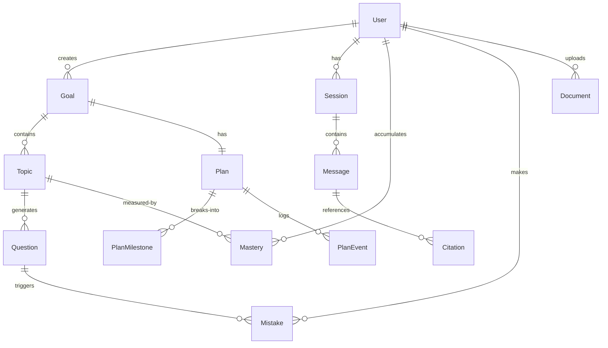
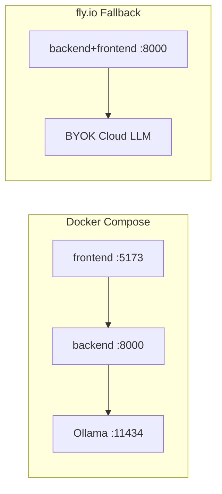

# P4c — Mobile & Docs Implementation Plan

> **For agentic workers:** REQUIRED SUB-SKILL: Use superpowers:subagent-driven-development (recommended) or superpowers:executing-plans to implement this plan task-by-task. Steps use checkbox (`- [ ]`) syntax for tracking.

**Goal:** Responsive Chat/Quiz/Plan views (<768px), MobileNav bottom tab bar, ARCHITECTURE.md v2 with ER diagram + 5 ADRs + deployment topology.

**Architecture:** `useMediaQuery` composable drives conditional rendering. `MobileNav.vue` replaces sidebar at `<768px`. `App.vue` rendered conditionally. ARCHITECTURE.md rewritten with Mermaid diagrams and new sections per spec.

**Tech Stack:** Native CSS media queries via Tailwind `max-md:`, no new deps

**Current baseline:** 233 backend tests passing, frontend build passing.

---

## Cut 1: Mobile Adaptation

### Task 1.1: Create useMediaQuery composable

**Files:**
- Create: `frontend/src/composables/useMediaQuery.ts`

```typescript
import { ref, onMounted, onUnmounted } from 'vue'

export function useMediaQuery(query: string) {
  const matches = ref(false)
  let mql: MediaQueryList | null = null

  function onChange(e: MediaQueryListEvent) { matches.value = e.matches }

  onMounted(() => {
    mql = window.matchMedia(query)
    matches.value = mql.matches
    mql.addEventListener('change', onChange)
  })
  onUnmounted(() => { mql?.removeEventListener('change', onChange) })

  return matches
}
```

- [ ] **Step 1: Verify composable**

```bash
cd frontend && pnpm build
```

Expected: no errors.

### Task 1.2: Create MobileNav bottom tab bar

**Files:**
- Create: `frontend/src/components/MobileNav.vue`

```vue
<script setup lang="ts">
import { MessageSquare, ListTodo, BookOpen, Menu } from 'lucide-vue-next'
import { RouterLink, useRoute } from 'vue-router'

const route = useRoute()

const tabs = [
  { to: '/chat', icon: MessageSquare, label: 'Chat' },
  { to: '/plan', icon: ListTodo, label: 'Plan' },
  { to: '/quiz', icon: BookOpen, label: 'Quiz' },
]
</script>

<template>
  <nav class="fixed bottom-0 left-0 right-0 h-14 bg-surface border-t border-border flex items-center justify-around z-50">
    <RouterLink
      v-for="tab in tabs" :key="tab.to" :to="tab.to"
      class="flex flex-col items-center gap-0.5 px-4 py-1 text-xs"
      :class="route.path === tab.to ? 'text-primary' : 'text-fg-muted'"
    >
      <component :is="tab.icon" class="w-5 h-5" />
      {{ tab.label }}
    </RouterLink>
  </nav>
</template>
```

- [ ] **Step 2: Commit**

```bash
git add frontend/src/composables/useMediaQuery.ts frontend/src/components/MobileNav.vue
git commit -m "feat: add useMediaQuery composable and MobileNav bottom tab bar"
```

### Task 1.3: Update App.vue for conditional sidebar/mobile nav

**Files:**
- Modify: `frontend/src/App.vue`

Add at top of `<script setup>`:

```typescript
import { useMediaQuery } from './composables/useMediaQuery'
import MobileNav from './components/MobileNav.vue'

const isMobile = useMediaQuery('(max-width: 767px)')
```

Replace the `nav` element with conditional rendering:

```html
<nav v-if="!isMobile" class="w-56 bg-surface p-4 flex flex-col gap-1 border-r border-border">
  <!-- existing nav content unchanged -->
</nav>
<main class="flex-1 overflow-hidden" :class="{ 'pb-14': isMobile }">
  <RouterView />
</main>
<MobileNav v-if="isMobile" />
```

- [ ] **Step 3: Commit**

```bash
git add frontend/src/App.vue
git commit -m "feat: conditionally render sidebar vs MobileNav based on viewport"
```

### Task 1.4: Responsive Chat view

**Files:**
- Modify: `frontend/src/views/Chat.vue`

Add `max-md:` responsive classes:

- Chat area: `max-md:px-2` (reduce padding)
- Bubble: `max-md:max-w-full` (full width on mobile)
- Input bar: `max-md:fixed max-md:bottom-14 max-md:left-0 max-md:right-0 max-md:px-2 max-md:py-2 max-md:bg-bg` (fixed above tab bar)
- Send button: `max-md:min-h-12 max-md:min-w-12` (48px touch target)

### Task 1.5: Responsive Quiz view

**Files:**
- Modify: `frontend/src/views/QuizAdaptive.vue`

- MCQCard radio buttons: `max-md:min-h-12` (48px touch target)
- DifficultySelector: `max-md:flex-wrap` (vertical stack on narrow screens)

### Task 1.6: Responsive Plan view

**Files:**
- Modify: `frontend/src/views/PlanTimeline.vue`

- Gantt vertical timeline: already single-column — naturally responsive
- MilestoneRow drag handle: `max-md:w-12` for touch zone

**Commit:**

```bash
git add frontend/src/views/Chat.vue frontend/src/views/QuizAdaptive.vue frontend/src/views/PlanTimeline.vue
git commit -m "feat: add responsive styles for Chat, Quiz, and Plan views (<768px)"
```

---

## Cut 2: ARCHITECTURE.md v2

### Task 2.1: Rewrite ARCHITECTURE.md

**Files:**
- Rewrite: `study-coach/docs/ARCHITECTURE.md`

Full content per spec `2026-05-26-p4c-mobile-docs-design.md` §2. Structure:

```markdown
# Study Coach — ARCHITECTURE v2

> Portfolio-grade agent app. FastAPI + LangGraph + Vue 3. Multi-model LLM with dual-track local/cloud BYOK.

## 1. System Overview

(keep updated v1 diagram + add: P3 shipped state, 233 tests, P4 deploy topology)

## 2. Entity-Relationship Diagram



## 3. Architecture Decision Records

### ADR 1: LangGraph StateGraph vs Chain-of-Prompts

**Context:** HKBU original project used linear prompt chaining...

### ADR 2: SM-2 vs Leitner Box

**Context:** Need SRS for quiz/mistake scheduling...

### ADR 3: Deterministic vs Agent Loop

**Context:** P2.2/P2.3 empirical ablation results...

### ADR 4: SQLite-only with Postgres Migration Path

**Context:** Portfolio demo needs zero-ops DB...

### ADR 5: BYOK Header Pattern

**Context:** Need per-request model/provider switching...

## 4. Agent Graph Topology

(updated from v1 — include memory_hydrator, router, quiz_master, planner, judge, memory_writer)

## 5. Tool Registry

(updated from v1 — include all 9+ tools)

## 6. Database Schema

(sync to current models.py state — include plan_milestones, plan_events)

## 7. API Routes

(sync to current routes.py state — include auth, tool-check, stats, reorder)

## 8. LLM Provider & BYOK Spec

(keep from v1, add tool-call detection section)

## 9. Frontend Architecture

(new section — stores map, component tree, design system reference)

## 10. Deployment Topology



## 11. Security Model

(new section — JWT auth, API key handling, CORS, SQL injection)

## 12. Performance Budgets

(placeholder — P95 latency targets TBD)

## 13. Observability & Monitoring

(placeholder — OpenTelemetry traces, token cost dashboard)

---

## Future: Full JadeAI-Grade Expansion

- Performance budgets: define P95 latency targets per endpoint
- Observability: OpenTelemetry traces across graph nodes
- Full ADR set: expand from 5 to 15+ (chunking, reranker, Chroma vs pgvector, ...)
```

The 5 ADRs must include filled **Context**, **Decision**, **Consequences** sections (not placeholders).

- [ ] **Step 1: Write the complete ARCHITECTURE.md v2**

Content per spec with all sections filled. 5 ADRs with full narrative.

- [ ] **Step 2: Commit**

```bash
git add docs/ARCHITECTURE.md
git commit -m "docs: ARCHITECTURE.md v2 with ER diagram, 5 ADRs, deployment topology, and security model"
```

---

## P4c Verification

```bash
# Frontend build
cd frontend && pnpm build
# Expected: no errors

# Visual smoke via chrome-devtools mobile viewport (375x667):
# - Chat: full-width bubbles, fixed input above tab bar
# - Quiz: touch targets >= 48px
# - Plan: vertical Gantt renders, drag-reorder works on touch

# ARCHITECTURE.md: Mermaid diagrams render correctly on GitHub
```
