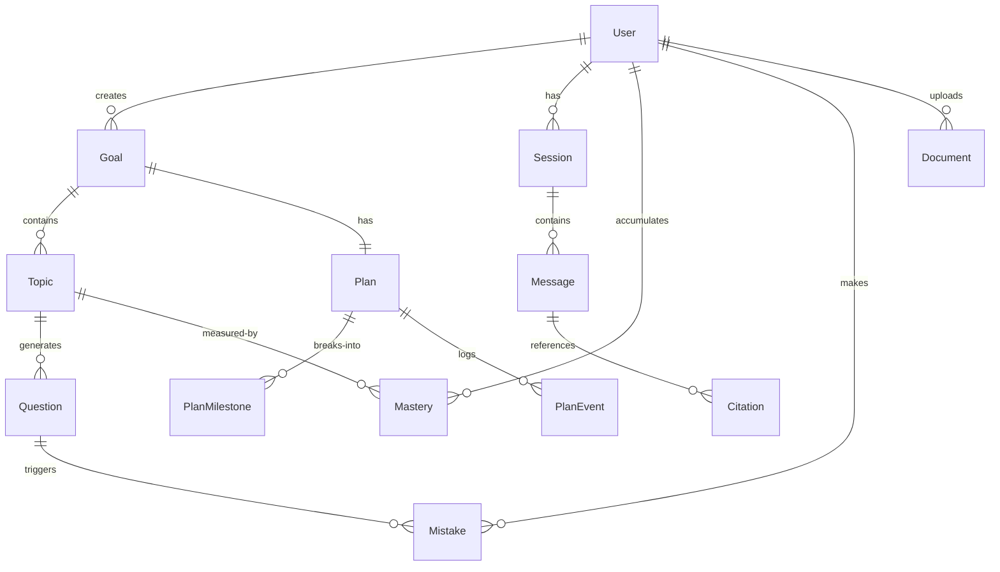

# P4c — Mobile & Docs Design

> 2026-05-26 brainstorm. P4c = Mobile adaptation (Chat/Quiz/Plan) + ARCHITECTURE.md v2.

## 1. Mobile Adaptation

### Scope: Chat + Quiz + Plan only

4 remaining views (Overview, MistakeBank, Library, Settings) keep P3 `<768px` banner.

### Navigation: sidebar → bottom tab bar

```
<768px:
┌──────────────────────────────────────┐
│  RouterView                           │
│  (flex-1, scroll)                     │
├──────────────────────────────────────┤
│  [Chat]  [Plan]  [Quiz]  [More ▾]   │  ← 56px fixed bottom
└──────────────────────────────────────┘
```

- Component: `MobileNav.vue`, rendered `v-if="isMobile"` in `App.vue`, replaces sidebar
- `More ▾` = overflow menu with Overview, MistakeBank, Library, Settings (secondary views)
- Icons: lucide-vue-next, 24px stroke
- Active state: `text-primary` + top border indicator (3px)

### Responsive behavior per view

**Chat** (`max-md:`):
- Chat area `padding-left: 0` (sidebar removed)
- Input bar fixed to bottom, above tab bar (`bottom: 56px`)
- Send button `min-h-12 min-w-12` (48px touch target)
- Bubble width: `max-w-full` instead of `max-w-[70%]`

**Quiz** (`max-md:`):
- MCQCard radio buttons: `min-h-12` touch targets
- DifficultySelector: horizontal scrollable (keep compact) or vertical stack if >3 options cause overflow
- Grade result: full-width card

**Plan** (`max-md:`):
- Gantt timeline: already single-column vertical — naturally responsive
- MilestoneRow: full-width, drag handle on left edge (48px touch zone)
- Drag-reorder: `@touchstart` / `@touchmove` / `@touchend` event handlers

### Composable

```ts
// frontend/src/composables/useMediaQuery.ts
export function useMediaQuery(query: string): Ref<boolean>
// Usage: const isMobile = useMediaQuery('(max-width: 767px)')
```

## 2. ARCHITECTURE.md v2

### Structure

```markdown
1. System Overview
2. Entity-Relationship Diagram (Mermaid)
3. Architecture Decision Records (5 ADRs)
4. Agent Graph Topology
5. Tool Registry
6. Database Schema
7. API Routes
8. LLM Provider & BYOK Spec
9. Frontend Architecture (NEW)
10. Deployment Topology (NEW)
11. Security Model (NEW)
12. Performance Budgets (PLACEHOLDER → A-tier expansion guide)
13. Observability & Monitoring (PLACEHOLDER → A-tier expansion guide)
```

### 5 ADRs

| # | Title | Context | Decision | Consequences |
|---|-------|---------|----------|--------------|
| 1 | **StateGraph vs chain-of-prompts** | HKBU original project used linear prompt chaining | LangGraph StateGraph with typed state + conditional routing | Isolated fault domains, retry per node, partial-state testability, but adds boilerplate vs. linear chains |
| 2 | **SM-2 vs Leitner box** | Need SRS for quiz/mistake scheduling | SM-2 with implicit repetition count (lite variant) | Continuous quality scores enable diagnostic precision (ease factor trends); more complex than Leitner but less than full SM-2 |
| 3 | **Deterministic vs agent loop** | P2.2/P2.3 empirical ablation results | Conditional: agent loop for ≥8B + tools; deterministic for smaller/older models | Production dispatch per `x-planner-mode` / `x-quiz-mode` headers; agent loop adds 3-20× latency but +0.05-0.16 quality on capable models |
| 4 | **SQLite-only (with Postgres migration path)** | Portfolio demo needs zero-ops DB | SQLite for all environments; repository layer returns `AsyncSession` — Postgres adapter is a connection string swap | No ops burden for demo; migration path preserved through repository pattern; no dual-DB sync bugs |
| 5 | **BYOK header pattern (not server-wide env)** | Need per-request model/provider switching | HTTP headers (`x-provider`, `x-model`, `x-api-key`) into `init_chat_model()` | Stateless, no server-side API key storage, but every request re-initializes model object (acceptable for demo scale) |

### ER Diagram (Mermaid)



### Frontend Architecture (new section)

```
views/
├── Overview.vue       → useOverviewStore (setup-store composing 4 stores)
├── Chat.vue           → useChatStore (SSE streaming + orderedParts)
├── Plan.vue           → usePlanStore (milestones + PlanTimeline + Gantt)
├── Quiz.vue           → useQuizStore (adaptive quiz + MCQCard + GradeResult)
├── MistakeBank.vue    → useMistakesStore (SM-2 due + redo + mark-understood)
├── Library.vue        → useDocumentsStore (upload + list)
├── Settings.vue       → useSettingsStore (BYOK + debug mode + language)
└── Onboarding.vue     → wizard (Step 1–3)

stores/          # Pinia — 1 store per resource group + 1 derived
components/      # shared UI primitives + view-specific components
composables/     # useMediaQuery, useFileUpload (extracted from Library)
locales/         # en.json, zh-CN.json
```

Frontend-to-backend mapping follows `stores → REST endpoint` 1:1 pattern (ARCHITECTURE.md §7).

### Deployment Topology (new section)

```
Primary (local demo):
  Docker Compose
  ├── backend  :8000 (FastAPI + LangGraph + Chroma + SQLite)
  ├── frontend :5173 (Vite dev server)
  └── ollama   :11434 (gemma3:4b + qwen2.5:7b pre-pulled)

Fallback (cloud demo link):
  fly.io (HKG region)
  └── single container (backend + nginx + frontend static files)
      ├── OLLAMA_ENABLED=false
      ├── SQLite on fly volume
      └── BYOK cloud-only (no local model)
```

### Security Model (new section)

| Concern | Implementation |
|---------|---------------|
| Auth | Google OAuth (member) / FingerprintJS (guest) → JWT Bearer |
| API key storage | `x-api-key` never logged or persisted server-side; frontend uses `localStorage` (demo scope — Web Crypto in production) |
| CORS | FastAPI `CORSMiddleware` — allow frontend origin only |
| SQL injection | SQLAlchemy ORM (parameterized queries) |
| Document upload | file size limit + extension whitelist (.pdf only) |

### A-tier expansion placeholders

```markdown
## Performance Budgets (placeholder)

P95 latency targets (to be defined post-deploy baseline):
- Chat SSE: first-byte < 500ms, time-to-done < 15s
- RAG retrieval: hybrid+rerank < 500ms
- Agent loop: wall time < 30s (max_iter=6)
- Quiz generation: < 5s (RAG-grounded)

## Observability & Monitoring (placeholder)

- OpenTelemetry traces: span per graph node + LLM call
- Metrics: token usage per model, judge score distribution over time
- Alerts: Ollama unreachable, Chroma persistence warning
- Dashboard: Grafana board linking token cost + user activity + model health
```

## 3. Cloud-adapt hooks

- `# cloud-adapt`: Mobile nav "More" menu may need feature-flag gating per cloud tenant config
- `# cloud-adapt`: ARCHITECTURE.md security model — cloud deploy adds rate limiting + API key rotation policy

## 4. Verification gates

- Mobile: chrome-devtools mobile viewport emulation on Chat/Quiz/Plan → all 3 pass visual smoke
- ARCHITECTURE.md v2: Mermaid ER diagram renders, all 5 ADRs have filled Context/Decision/Consequences sections
- No regressions: 233 backend tests still green, frontend build passes
